<p align="center">
  
</p>

CSS Flexbox
=====================

CSS Flexible Box Layout Module (Flexbox) is one of the most widely used and popular mechanisms which provides flexibility to create/build or design professional layouts/nested layouts.

Welcome
---------------------

Hi All, I'm **`Dinanath Jayaswal, Senior UI/Web Developer and Adobe Certified Expert Professional`**, I wanna welcome you to CSS Flexbox Tutorial for beginners. 

About the Course/Tutorial
---------------------

This is a comprehensive guide to CSS flexbox layout. This complete guide explains everything about the flexbox.

Who is this for? 
---------------------

This Course/Tutorial is ideal for:
- Any Web designer/developer interested in getting a deep understanding of Flexbox
- CSS lovers
- Candidates desire to become CSS Expert and better Front End web Developer / Designer
- Web designers/developers who want to improve skills with new web standards

Course/Tutorial achievement
---------------------

Course/Tutorial Goal
---------------------

After completing/attending/finishing this Course/Tutorial, participants should be able to: 
- Align elements using modern CSS module, like CSS Flexbox 
  - vertically align any element
- Use the new CSS3 Flexbox box model to create responsive web layouts more effectively!
  - add spacing between elements
  - take up remaining space
- Use/Operate CSS Flexbox confidently to create modern/advanced layouts
  - implement complete site layouts / create modern grids

Prerequisites for current course / What you need to know
---------------------

- Basic knowledge of HTML5 and CSS3

Topics included/covered
=====================

1. [Introduction to CSS Flexbox](#1-introduction-to-css-flexbox)
    - 1.1. [What is CSS Flexbox](#11-what-is-css-flexbox)
    - 1.2. [Layout modes](#12-layout-modes)
    - 1.3. [Why Flexbox?](#13-why-flexbox)
    - 1.4. [Important Terminology](#14-important-terminology)
    - 1.5. [Flexbox axis](#15-flexbox-axis)
    - 1.6. [Browser support](#16-browser-support)

2. [Flex Container Properties](#2-flex-container-properties)
    - 2.1. [Flex Display](#21-flex-display)
    - 2.2. [Flex Direction](#22-flex-direction)
    - 2.3. [Flex Wrap](#23-flex-wrap)

1 Introduction to CSS Flexbox
=====================

1.1. What is CSS Flexbox
---------------------

`CSS Flexible Box Layout Module` is also known and referred to as `CSS Flexbox`, is designed for one-dimensional layout model that makes it easy to:
- Design flexible and efficient layouts
- Distribute space among items
- Control alignments of objects/elements/items in given container
- Flexbox layout is most appropriate to the components of an application, and small-scale layouts
- Flexbox is a new CSS display type designed to craft CSS layouts in a much easier way
- Control the position, size, and spacing of child elements relative to parent container and other child elements
- W3C Candidate Recommendation as of October 2017

1.2. Layout modes
---------------------

Before CSS Flexbox there were 4 layout modes/models:
1. **`Block`** (for different sections in a webpage)
2. **`Inline`** (for text and spans in the same line)
3. **`Table`** (for two-dimensional tabular data)
4. **`Position`** (for the explicit position of an element)

### Pre-Flexbox we have used:
- Different positional properties like `fixed, absolute` to set alignment at the exact required place
- Floats and clear fixes to create navigation, detailed section
- Fixed heights columns to show equality
- Above mentioned layout modes does not provide enough flexibility to create/build or design professional/nested/modern layouts
- we need to include another CSS mechanism like Floats, Vertical alignment of text/elements and other hacks with Margin, Padding to create the accurate/desired layout
- CSS Flexible Box Layout Module (Flexbox), makes it easier to design flexible responsive layout structure without using float or positioning

1.3. Why Flexbox?
---------------------

- Flex/CSS Flexbox layout provides lots of flexibilities while creating complex layouts like:
  - arrange items from left to right or top to bottom and vice versa
  - adjust the spacing between objects
  - alignments of items
  - order and placements of various elements 
  - improve the items alignment, directions and order in the container even when they are with dynamic or even unknown size
  - equal height columns
  - ability to modify the width or height of its children to fill the available space in the best possible way on different screen sizes
  - Flexbox is a new CSS display type designed to craft CSS layouts in a much easier way
  - Control the position, size, and spacing of child elements relative to parent container and other child elements
  - CSS flexbox works great responsively (RWD - Responsive Web Design)
  - Bootstrap 4 is built-on with Flex layout Model

1.4. Important Terminology
---------------------

Let's learn some of the Important Terminology/concepts related to CSS flexbox to get proper understandings and how it works. There are main three terms or entities while dealing with flexbox:
1. **`Flex Container`** (Parent/Container to hold sub-items)
2. **`Flex Items`** (Child/sub-items)
3. **`Flexbox axis`** (Main axis [horizontal] and Cross axis [vertical])

> **Syntax & Example**: `1.4-flex-container-item.html basic markup`

```html
<div class="main-container">
  <div class="item item-1">item-1</div>
  <div class="item item-2">item-2</div>
  <div class="item item-3">item-3</div>
  <div class="item item-4">item-4</div>
  <div class="item item-5">item-5</div>
  <div class="item item-6">item-6</div>
  <div class="item item-7">item-7</div>
  <div class="item item-8">item-8</div>
  <div class="item item-9">item-9</div>
  <div class="item item-10">item-10</div>
</div>
```

<hr/>

> **Syntax & Example**: `1.4-flex-container-item.html default`

```html
<!DOCTYPE html>

<html lang="en">

  <head>
    <meta charset="UTF-8">
    <meta name="viewport" content="width=device-width, initial-scale=1.0">
    <meta http-equiv="X-UA-Compatible" content="ie=edge">
    <title>1.4-flex-container-item.html</title>

    <style type="text/css">

      body {
        margin: 0;
        padding: 0;
        font-family: verdana;
      }

      .main-container {
        border: 4px solid #826a98;
      }

      .item {
        color: #ffffff;
        font-size: 1rem;
        padding: 0.75rem;
        text-align: center;
      }

      .item-1 {
        background-color:#DDA0DD;
      }

      .item-2 {
        background-color:#BF94E4;
      }

      .item-3 {
        background-color:#734F96;
      }

      .item-4 {
        background-color:#FBAED2;
      }

      .item-5 {
        background-color:#EE82EE;
      }
      
      .item-6 {
        background-color:#ADE4CA;
      }

      .item-7 {
        background-color:#A6D5AE;
      }

      .item-8 {
        background-color:#8FBC8E;
      }

      .item-9 {
        background-color: #64A466;
      }
      
      .item-10 {
        background-color:#2E8B56;
      }

    </style>

  </head>

  <body>

    <div class="main-container">
      <div class="item item-1">item-1</div>
      <div class="item item-2">item-2</div>
      <div class="item item-3">item-3</div>
      <div class="item item-4">item-4</div>
      <div class="item item-5">item-5</div>
      <div class="item item-6">item-6</div>
      <div class="item item-7">item-7</div>
      <div class="item item-8">item-8</div>
      <div class="item item-9">item-9</div>
      <div class="item item-10">item-10</div>
    </div>
    
  </body>
  
</html>
```

<p>
  <figure>
    &nbsp;&nbsp;&nbsp; 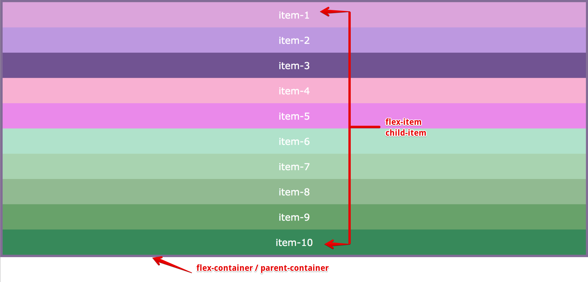
    <figcaption>&nbsp;&nbsp;&nbsp; Image - Flex parent container and flex child item markup </figcaption>
  </figure>
</p>

<hr/>

> **Syntax & Example**: `1.4-flex-container-item.html display:flex`

```html
<style type="text/css">
  .main-container {
    border: 4px solid #826a98;
    display: flex; /* block level flex container */
  }
</style>
```

<p>
  <figure>
    &nbsp;&nbsp;&nbsp; 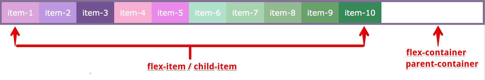
    <figcaption>&nbsp;&nbsp;&nbsp; Image - Flex parent container, child item with display flex </figcaption>
  </figure>
</p>

<hr/>

1.5. Flexbox axis
---------------------

1. **`Main Axis`**
    - By default, main/primary axis runs Left to Right
    - Its denoted with terms like the main start and main end
    - The length between the main start to the main end is known as the main size
2. **`Cross Axis`**
    - By default, cross-axis runs Top to Bottom
    - Its denoted with terms like cross start and cross end
    - The length between cross start to cross end is known as cross size

<p>
  <figure>
    &nbsp;&nbsp;&nbsp; 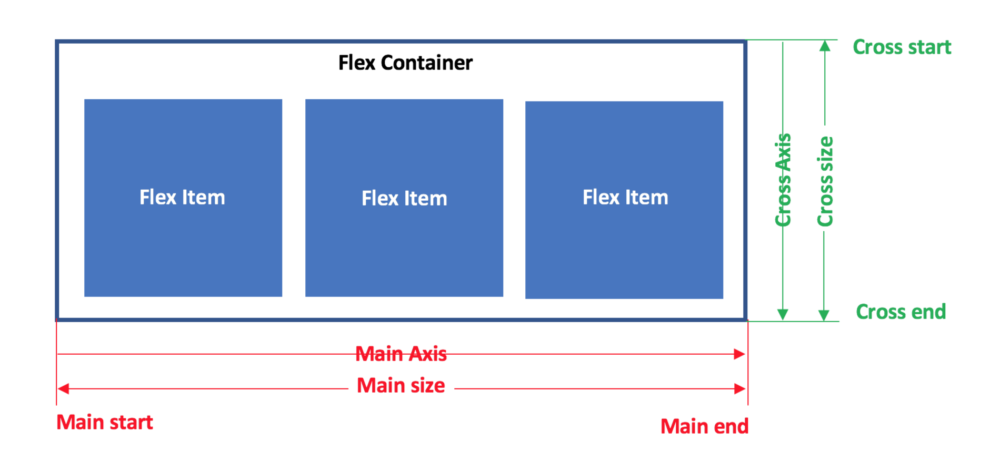
    <figcaption>&nbsp;&nbsp;&nbsp; Image - flex axis - main axis and cross axis </figcaption>
  </figure>
</p>

<hr/>

<p>
  <figure>
    &nbsp;&nbsp;&nbsp; 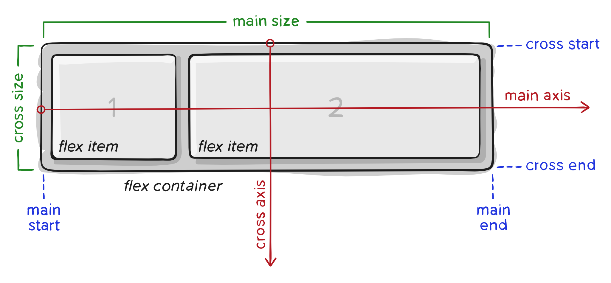
    <figcaption>&nbsp;&nbsp;&nbsp; Image - flex axis - main axis and cross axis </figcaption>
  </figure>
</p>

<hr/>

<p>
  <figure>
    &nbsp;&nbsp;&nbsp; 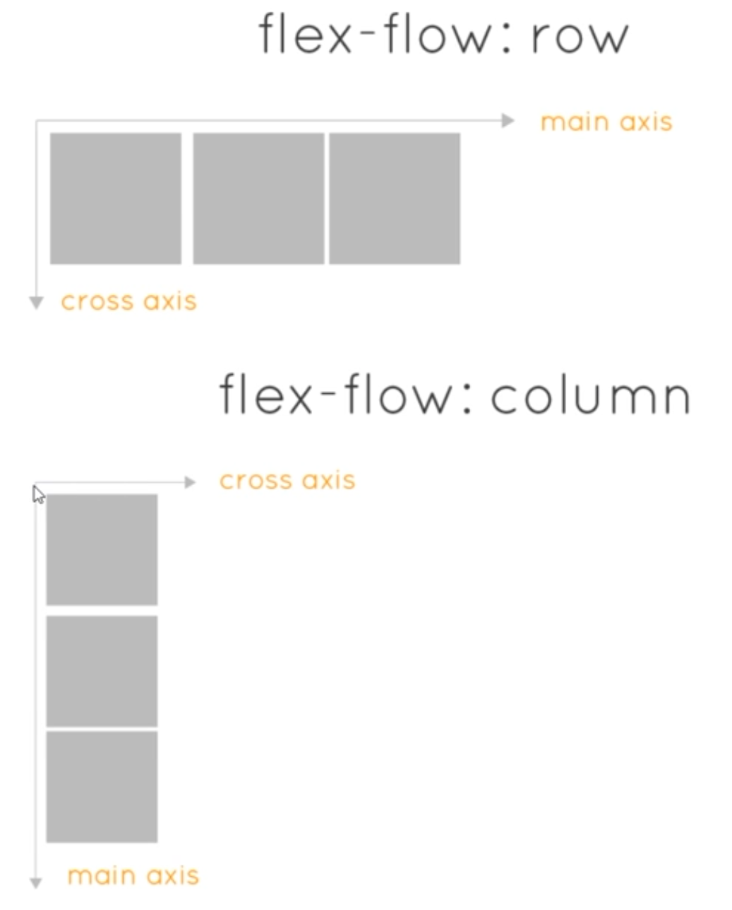
    <figcaption>&nbsp;&nbsp;&nbsp; Image - flex axis - main axis and cross axis for Row and Column </figcaption>
  </figure>
</p>

1.6. Browser support
---------------------

The flexbox properties are supported in all modern browsers:

<p>
  <figure>
    &nbsp;&nbsp;&nbsp; 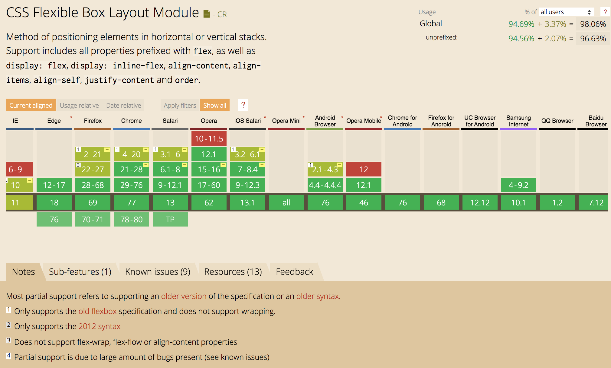
    <figcaption>&nbsp;&nbsp;&nbsp; Image - css flexbox browser support </figcaption>
  </figure>
</p>

2 Flex Container Properties
===================== 

Let's look into some of the important properties used with Flex Container:
- **`display`**
  - It defines the Flex Container inline or block
  - An important and mandatory property to work with Flexbox
- **`flex-direction`**
  - Defines direction for flex items to be placed inside Flex Container
- **`flex-wrap`**
  - Set wrapping of items within Flex Container (overflow item placement)
- **`flex-flow`**
  - Short-hand property for a combination of flex-direction and flex-wrap
- **`justify-content`**
  - Defines alignment of items along the main axis
- **`align-items`**
  - How flex items layout/laid out with the cross axis
- **`align-content`**
  - Alignment of items along the cross axis (if multiple rows/lines available)


2.1. Flex Display
---------------------

- To create a flex container, we set the value of the container's `display` property to `flex` or `inline-flex`
- It enables a flex context for all its direct children

`display` property creates either a `block-level` or `inline-level` flex container:
- **`display: flex`**;
  - block level flex, covers 100% width
- **`display: inline-flex`**;
  - inline-level, same line flex, covers only required width as per items width
- syntax:
```css 
.container {
  display: flex; /* block level flex container */
  display: inline-flex; /* inline flex container */ 
}
```

> **Syntax & Example**: `2.1-flex-display.html,  display: flex; /* block level flex container */`

```html
<!DOCTYPE html>

<html lang="en">

  <head>
    <meta charset="UTF-8">
    <meta name="viewport" content="width=device-width, initial-scale=1.0">
    <meta http-equiv="X-UA-Compatible" content="ie=edge">
    <title>2.1-flex-display</title>

    <style type="text/css">

      body {
        margin: 0;
        padding: 0;
        font-family: verdana;
      }

      .main-container {
        border: 4px solid #826a98;
        display: flex; /* block level flex container */
      }

      .item {
        color: #ffffff;
        font-size: 1rem;
        padding: 0.75rem;
        text-align: center;
      }

      .item-1 {
        background-color:#DDA0DD;
      }

      .item-2 {
        background-color:#BF94E4;
      }

      .item-3 {
        background-color:#734F96;
      }

      .item-4 {
        background-color:#FBAED2;
      }

      .item-5 {
        background-color:#EE82EE;
      }
      
      .item-6 {
        background-color:#ADE4CA;
      }

      .item-7 {
        background-color:#A6D5AE;
      }

      .item-8 {
        background-color:#8FBC8E;
      }

      .item-9 {
        background-color: #64A466;
      }
      
      .item-10 {
        background-color:#2E8B56;
      }

    </style>

  </head>

  <body>

    <div class="main-container">
      <div class="item item-1">item-1</div>
      <div class="item item-2">item-2</div>
      <div class="item item-3">item-3</div>
      <div class="item item-4">item-4</div>
      <div class="item item-5">item-5</div>
      <div class="item item-6">item-6</div>
      <div class="item item-7">item-7</div>
      <div class="item item-8">item-8</div>
      <div class="item item-9">item-9</div>
      <div class="item item-10">item-10</div>
    </div>
    
  </body>
  
</html>
```

<p>
  <figure>
    &nbsp;&nbsp;&nbsp; 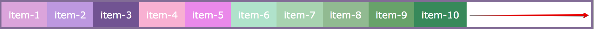
    <figcaption>&nbsp;&nbsp;&nbsp; Image - display: flex; </figcaption>
  </figure>
</p>

<hr/>

> **Syntax & Example**: `2.1-flex-display.html,  display: inline-flex; /* inline flex container */`

```css
.main-container {
  border: 4px solid #826a98;
  /* display: flex; */ /* block level flex container */
  display: inline-flex; /* inline flex container */ 
}
```

<p>
  <figure>
    &nbsp;&nbsp;&nbsp; 
    <figcaption>&nbsp;&nbsp;&nbsp; Image - display: inline-flex; </figcaption>
  </figure>
</p>

2.2. Flex Direction
---------------------

- The flex-direction property decides/defines how flex items will stack inside flex container along the main axis, by default it's Main Axis runs from Left to Right
- Flex items can be laid out in two main directions, like rows horizontally or like columns vertically

`flex-direction` property sets the direction of the flex items along with the main axis:
- **`flex-direction: row`**;
  - Default direction is row-wise ie. left to right alignment
  - With row direction, the flex items are stacked in a row from left-to-right
- **`flex-direction: row-reverse`**;
  - Right to left alignment (item alignment will start from right to left - item 1 will start from right)
- **`flex-direction: column`**;
  - The column value stacks the flex items vertically (from top to bottom)
- **`flex-direction: column-reverse`**;
  - bottom to top (item alignment will start from bottom to top - item 1 will start from the bottom)
- syntax:
```css 
.container {
  display: inline-flex;
  
  flex-direction: row;
}
```

> **Syntax & Example**: `2.2-flex-direction.html, flex-direction: row; /* left to right */`

```html
<!DOCTYPE html>

<html lang="en">

  <head>
    <meta charset="UTF-8">
    <meta name="viewport" content="width=device-width, initial-scale=1.0">
    <meta http-equiv="X-UA-Compatible" content="ie=edge">
    <title>2.2-flex-direction</title>

    <style type="text/css">

      body {
        margin: 0;
        padding: 0;
        font-family: verdana;
      }

      .main-container {
        border: 4px solid #826a98;
        /* display: flex; */ /* block level flex container */
        display: inline-flex; /* inline flex container */
        
        /* flex-direction: row; */ /* left to right */
        /* flex-direction: row-reverse; */ /* right to left */
        /* flex-direction: column; */ /* top to bottom */
        flex-direction: column-reverse; /* bottom to top */
      }

      .item {
        color: #ffffff;
        font-size: 1rem;
        padding: 0.75rem;
        text-align: center;
      }

      .item-1 {
        background-color:#DDA0DD;
      }

      .item-2 {
        background-color:#BF94E4;
      }

      .item-3 {
        background-color:#734F96;
      }

      .item-4 {
        background-color:#FBAED2;
      }

      .item-5 {
        background-color:#EE82EE;
      }
      
      .item-6 {
        background-color:#ADE4CA;
      }

      .item-7 {
        background-color:#A6D5AE;
      }

      .item-8 {
        background-color:#8FBC8E;
      }

      .item-9 {
        background-color: #64A466;
      }
      
      .item-10 {
        background-color:#2E8B56;
      }

    </style>

  </head>

  <body>

    <div class="main-container">
      <div class="item item-1">item-1</div>
      <div class="item item-2">item-2</div>
      <div class="item item-3">item-3</div>
      <div class="item item-4">item-4</div>
      <div class="item item-5">item-5</div>
      <div class="item item-6">item-6</div>
      <div class="item item-7">item-7</div>
      <div class="item item-8">item-8</div>
      <div class="item item-9">item-9</div>
      <div class="item item-10">item-10</div>
    </div>
    
  </body>
  
</html>
```

<p>
  <figure>
    &nbsp;&nbsp;&nbsp; 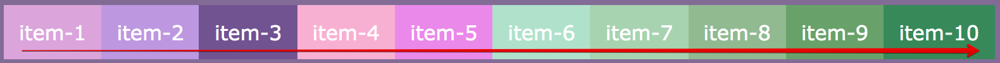
    <figcaption>&nbsp;&nbsp;&nbsp; Image - flex-direction: row; </figcaption>
  </figure>
</p>

<hr/>

<p>
  <figure>
  &nbsp;&nbsp;&nbsp; 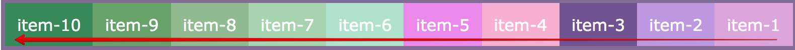
    <figcaption>&nbsp;&nbsp;&nbsp; Image - flex-direction: row-reverse; </figcaption>
  </figure>
</p>

<hr/>

<p>
  <figure>
    &nbsp;&nbsp;&nbsp; 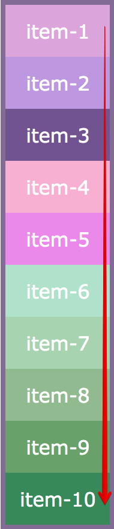
    <figcaption>&nbsp;&nbsp;&nbsp; Image - flex-direction: column; </figcaption>
  </figure>
</p>

<hr/>

<p>
  <figure>
    &nbsp;&nbsp;&nbsp; 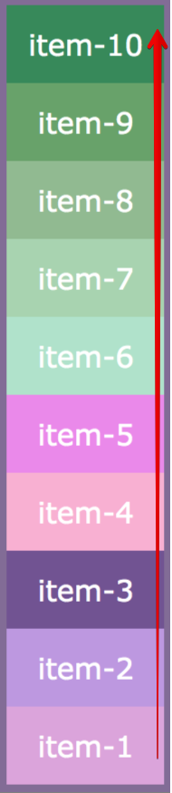
    <figcaption>&nbsp;&nbsp;&nbsp; Image - flex-direction: column-reverse; </figcaption>
  </figure>
</p>

2.3. Flex Wrap
---------------------

By default all items in Flex Container try to fit themself in a container in one row/column. If enough space not available, items simply overflow - with the help of `flex-wrap` property we can set the overflow direction 

- The `flex-wrap` property specifies whether the flex items should wrap or not
- The `flex-wrap` property simply determines how items are wrapped when parent container runs out of space

`flex-wrap` property controls the wrapping of flex items within the container:
- **`flex-wrap: nowrap;`** (default is row nowrap)
- **`flex-wrap: wrap;`** (wraps overflow items to bottom/next row or right/next column)
- **`flex-wrap: wrap-reverse;`** (wraps overflow items to top row or left column)
- syntax:
```css
.container {
  display: inline-flex;
  
  flex-wrap: wrap;
}
```

### 2.3.1. Row wise flex-wrap

> **Syntax & Example**: `2.3.1-flex-wrap-row.html flex-wrap: wrap; /* wraps overflow items to bottom/next row */`

```css
.main-container {
  border: 4px solid #826a98;
  display: flex; /* block level flex container */

  /* flex-wrap: nowrap; */ /* default is row nowrap */
  /* flex-wrap: wrap; */ /* wraps overflow items to bottom/next row */
  flex-wrap: wrap-reverse; /* wraps overflow items to top row */
}
```

<p>
  <figure>
    &nbsp;&nbsp;&nbsp; 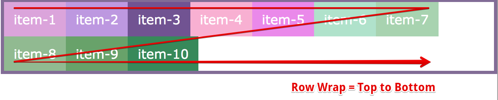
    <figcaption>&nbsp;&nbsp;&nbsp; Image - row flex-wrap: wrap; </figcaption>
  </figure>
</p>

<p>
  <figure>
    &nbsp;&nbsp;&nbsp; 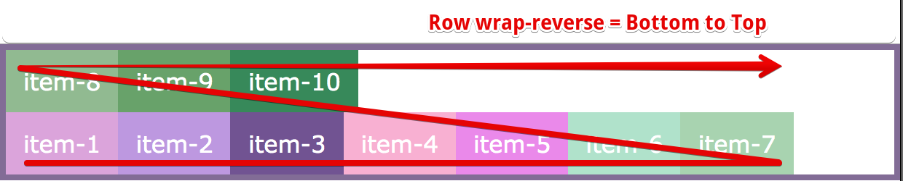
    <figcaption>&nbsp;&nbsp;&nbsp; Image - row flex-wrap: wrap-reverse; </figcaption>
 </figure>
</p>

<hr/>

### 2.3.2. Columner/Column wise flex-wrap

> **Syntax & Example**: `2.3.2-flex-wrap-column.html flex-wrap: wrap; /* wraps overflow items to right/next column */`

```css
.main-container {
  border: 4px solid #826a98;
  display: flex; /* block level flex container */

  height: 300px;
  flex-direction: column;
  /* flex-wrap: nowrap; */ /* default is nowrap */
  /* flex-wrap: wrap; */ /* wraps overflow items to right/next column */
  flex-wrap: wrap-reverse; /* wraps overflow items to left column */
}
```

<p>
  <figure>
    &nbsp;&nbsp;&nbsp; 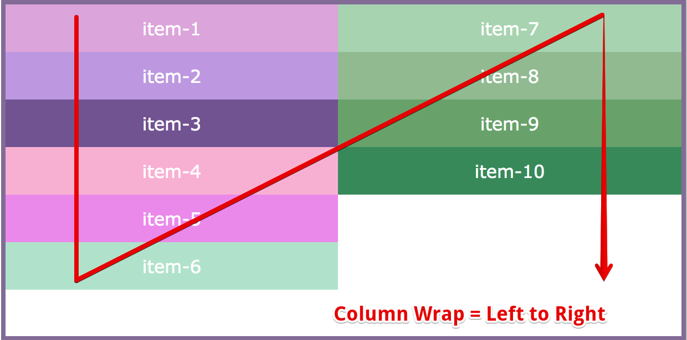
    <figcaption>&nbsp;&nbsp;&nbsp; Image - column flex-wrap: wrap; </figcaption>
  </figure>
</p>

<p>
  <figure>
    &nbsp;&nbsp;&nbsp; 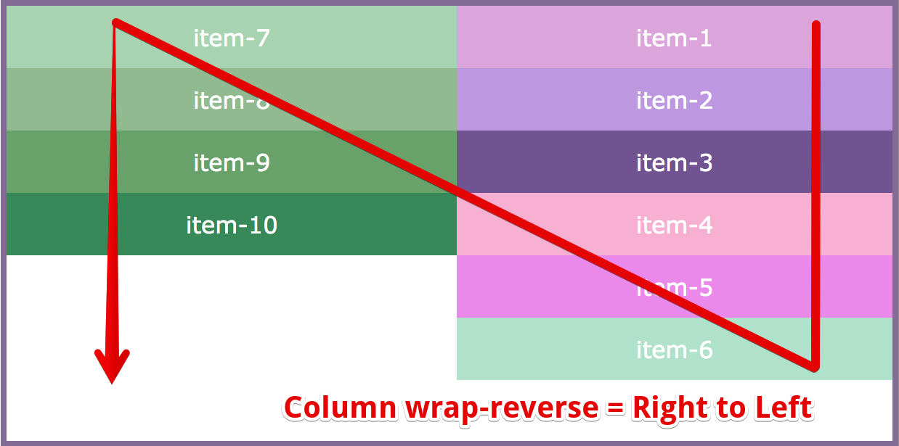
    <figcaption>&nbsp;&nbsp;&nbsp; Image - column flex-wrap: wrap-reverse; </figcaption>
  </figure>
</p>
