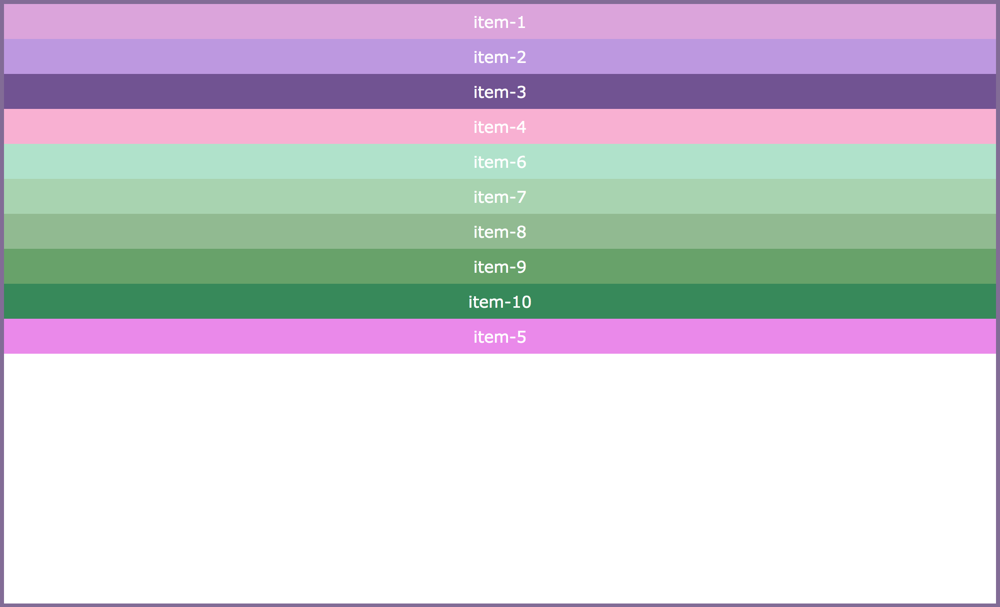
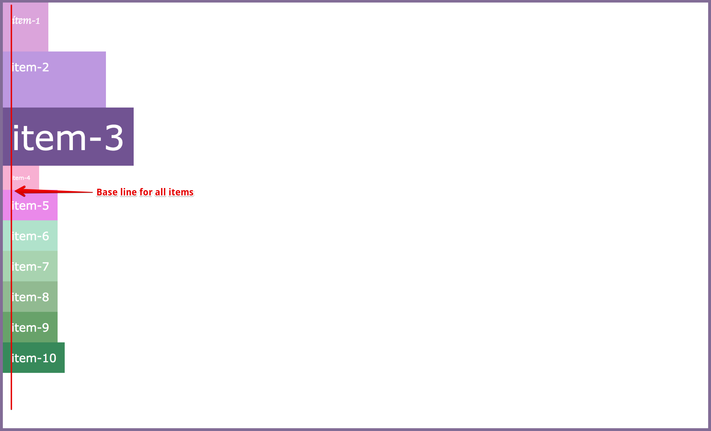
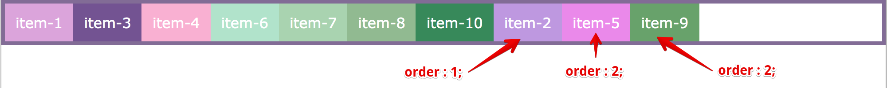
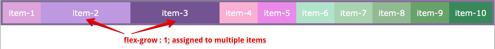

<p align="center">
  
</p>

CSS Flexbox
=====================

CSS Flexible Box Layout Module (Flexbox) is one of the most widely used and popular mechanisms which provides flexibility to create/build or design professional layouts/nested layouts.

Welcome
---------------------

Hi All, I'm **`Dinanath Jayaswal, Senior UI/Web Developer and Adobe Certified Expert Professional`**, I wanna welcome you to CSS Flexbox Tutorial for beginners. 

About the Course/Tutorial
---------------------

This is a comprehensive guide to CSS flexbox layout. This complete guide explains everything about the flexbox.

Who is this for? 
---------------------

This Course/Tutorial is ideal for:
- Any Web designer/developer interested in getting a deep understanding of Flexbox
- CSS lovers
- Candidates desire to become CSS Expert and better Front End web Developer / Designer
- Web designers/developers who want to improve skills with new web standards

Course/Tutorial achievement
---------------------

Course/Tutorial Goal
---------------------

After completing/attending/finishing this Course/Tutorial, participants should be able to: 
- Align elements using modern CSS module, like CSS Flexbox 
  - vertically align any element
- Use the new CSS3 Flexbox box model to create responsive web layouts more effectively!
  - add spacing between elements
  - take up remaining space
- Use/Operate CSS Flexbox confidently to create modern/advanced layouts
  - implement complete site layouts / create modern grids

Prerequisites for current course / What you need to know
---------------------

- Basic knowledge of HTML5 and CSS3

Topics included/covered
=====================

1. [Introduction to CSS Flexbox](#1-introduction-to-css-flexbox)
    - 1.1. [What is CSS Flexbox](#11-what-is-css-flexbox)
    - 1.2. [Layout modes](#12-layout-modes)
    - 1.3. [Why Flexbox?](#13-why-flexbox)
    - 1.4. [Important Terminology](#14-important-terminology)
    - 1.5. [Flexbox axis](#15-flexbox-axis)
    - 1.6. [Browser support](#16-browser-support)

2. [Flex Container Properties](#2-flex-container-properties)
    - 2.1. [Flex Display](#21-flex-display)
    - 2.2. [Flex Direction](#22-flex-direction)
    - 2.3. [Flex Wrap](#23-flex-wrap)
    - 2.4. [Flex Flow](#24-flex-flow)
    - 2.5. [Justify Content](#25-justify-content)
    - 2.6. [Align Items](#26-align-items)
    - 2.7. [Align Content](#27-align-content)

3. [Flex Item Properties](#3-flex-item-properties)
    - 3.1. [Order](#31-order)
    - 3.2. [Flex Grow](#32-flex-grow)
    - 3.3. [Flex Shrink](#33-flex-shrink)
    - 3.4. [Flex Basis](#34-flex-basis)
    - 3.5. [Flex](#35-flex)
    - 3.6. [Align Self](#36-align-self)

4. [Flex Practical Demo Examples](#4-flex-practical-demo-examples)
  - 4.1. [Perfect Center](#41-perfect-center)
  - 4.2. [Flex Navbar](#42-flex-navbar)
  - 4.3. [Item height adjustment](#43-item-height-adjustment)

1 Introduction to CSS Flexbox
=====================

1.1. What is CSS Flexbox
---------------------

`CSS Flexible Box Layout Module` is also known and referred to as `CSS Flexbox`, is designed for one-dimensional layout model that makes it easy to:
- Design flexible and efficient layouts
- Distribute space among items
- Control alignments of objects/elements/items in given container
- Flexbox layout is most appropriate to the components of an application, and small-scale layouts
- Flexbox is a new CSS display type designed to craft CSS layouts in a much easier way
- Control the position, size, and spacing of child elements relative to parent container and other child elements
- W3C Candidate Recommendation as of October 2017

1.2. Layout modes
---------------------

Before CSS Flexbox there were 4 layout modes/models:
1. **`Block`** (for different sections in a webpage)
2. **`Inline`** (for text and spans in the same line)
3. **`Table`** (for two-dimensional tabular data)
4. **`Position`** (for the explicit position of an element)

### Pre-Flexbox we have used:
- Different positional properties like `fixed, absolute` to set alignment at the exact required place
- Floats and clear fixes to create navigation, detailed section
- Fixed heights columns to show equality
- Above mentioned layout modes does not provide enough flexibility to create/build or design professional/nested/modern layouts
- we need to include another CSS mechanism like Floats, Vertical alignment of text/elements and other hacks with Margin, Padding to create the accurate/desired layout
- CSS Flexible Box Layout Module (Flexbox), makes it easier to design flexible responsive layout structure without using float or positioning

1.3. Why Flexbox?
---------------------

- Flex/CSS Flexbox layout provides lots of flexibilities while creating complex layouts like:
  - arrange items from left to right or top to bottom and vice versa
  - adjust the spacing between objects
  - alignments of items
  - order and placements of various elements 
  - improve the items alignment, directions and order in the container even when they are with dynamic or even unknown size
  - equal height columns
  - ability to modify the width or height of its children to fill the available space in the best possible way on different screen sizes
  - Flexbox is a new CSS display type designed to craft CSS layouts in a much easier way
  - Control the position, size, and spacing of child elements relative to parent container and other child elements
  - CSS flexbox works great responsively (RWD - Responsive Web Design)
  - Bootstrap 4 is built-on with Flex layout Model

1.4. Important Terminology
---------------------

Let's learn some of the Important Terminology/concepts related to CSS flexbox to get proper understandings and how it works. There are main three terms or entities while dealing with flexbox:
1. **`Flex Container`** (Parent/Container to hold sub-items)
2. **`Flex Items`** (Child/sub-items)
3. **`Flexbox axis`** (Main axis [horizontal] and Cross axis [vertical])

> **Syntax & Example**: `1.4-flex-container-item.html basic markup`

```html
<div class="main-container">
  <div class="item item-1">item-1</div>
  <div class="item item-2">item-2</div>
  <div class="item item-3">item-3</div>
  <div class="item item-4">item-4</div>
  <div class="item item-5">item-5</div>
  <div class="item item-6">item-6</div>
  <div class="item item-7">item-7</div>
  <div class="item item-8">item-8</div>
  <div class="item item-9">item-9</div>
  <div class="item item-10">item-10</div>
</div>
```

<hr/>

> **Syntax & Example**: `1.4-flex-container-item.html default`

```html
<!DOCTYPE html>

<html lang="en">

  <head>
    <meta charset="UTF-8">
    <meta name="viewport" content="width=device-width, initial-scale=1.0">
    <meta http-equiv="X-UA-Compatible" content="ie=edge">
    <title>1.4-flex-container-item.html</title>

    <style type="text/css">

      body {
        margin: 0;
        padding: 0;
        font-family: verdana;
      }

      .main-container {
        border: 4px solid #826a98;
      }

      .item {
        color: #ffffff;
        font-size: 1rem;
        padding: 0.75rem;
        text-align: center;
      }

      .item-1 {
        background-color:#DDA0DD;
      }

      .item-2 {
        background-color:#BF94E4;
      }

      .item-3 {
        background-color:#734F96;
      }

      .item-4 {
        background-color:#FBAED2;
      }

      .item-5 {
        background-color:#EE82EE;
      }
      
      .item-6 {
        background-color:#ADE4CA;
      }

      .item-7 {
        background-color:#A6D5AE;
      }

      .item-8 {
        background-color:#8FBC8E;
      }

      .item-9 {
        background-color: #64A466;
      }
      
      .item-10 {
        background-color:#2E8B56;
      }

    </style>

  </head>

  <body>

    <div class="main-container">
      <div class="item item-1">item-1</div>
      <div class="item item-2">item-2</div>
      <div class="item item-3">item-3</div>
      <div class="item item-4">item-4</div>
      <div class="item item-5">item-5</div>
      <div class="item item-6">item-6</div>
      <div class="item item-7">item-7</div>
      <div class="item item-8">item-8</div>
      <div class="item item-9">item-9</div>
      <div class="item item-10">item-10</div>
    </div>
    
  </body>
  
</html>
```

<p>
  <figure>
    &nbsp;&nbsp;&nbsp; 
    <figcaption>&nbsp;&nbsp;&nbsp; Image - Flex parent container and flex child item markup </figcaption>
  </figure>
</p>

<hr/>

> **Syntax & Example**: `1.4-flex-container-item.html display:flex`

```html
<style type="text/css">
  .main-container {
    border: 4px solid #826a98;
    display: flex; /* block level flex container */
  }
</style>
```

<p>
  <figure>
    &nbsp;&nbsp;&nbsp; 
    <figcaption>&nbsp;&nbsp;&nbsp; Image - Flex parent container, child item with display flex </figcaption>
  </figure>
</p>

<hr/>

1.5. Flexbox axis
---------------------

1. **`Main Axis`**
    - By default, main/primary axis runs Left to Right
    - Its denoted with terms like the main start and main end
    - The length between the main start to the main end is known as the main size
2. **`Cross Axis`**
    - By default, cross-axis runs Top to Bottom
    - Its denoted with terms like cross start and cross end
    - The length between cross start to cross end is known as cross size

<p>
  <figure>
    &nbsp;&nbsp;&nbsp; 
    <figcaption>&nbsp;&nbsp;&nbsp; Image - flex axis - main axis and cross axis </figcaption>
  </figure>
</p>

<hr/>

<p>
  <figure>
    &nbsp;&nbsp;&nbsp; 
    <figcaption>&nbsp;&nbsp;&nbsp; Image - flex axis - main axis and cross axis </figcaption>
  </figure>
</p>

<hr/>

<p>
  <figure>
    &nbsp;&nbsp;&nbsp; 
    <figcaption>&nbsp;&nbsp;&nbsp; Image - flex axis - main axis and cross axis for Row and Column </figcaption>
  </figure>
</p>

1.6. Browser support
---------------------

The flexbox properties are supported in all modern browsers:

<p>
  <figure>
    &nbsp;&nbsp;&nbsp; 
    <figcaption>&nbsp;&nbsp;&nbsp; Image - css flexbox browser support </figcaption>
  </figure>
</p>

2 Flex Container Properties
===================== 

Let's look into some of the important properties used with Flex Container:
- **`display`**
  - It defines the Flex Container inline or block
  - An important and mandatory property to work with Flexbox
- **`flex-direction`**
  - Defines direction for flex items to be placed inside Flex Container
- **`flex-wrap`**
  - Set wrapping of items within Flex Container (overflow item placement)
- **`flex-flow`**
  - Short-hand property for a combination of flex-direction and flex-wrap
- **`justify-content`**
  - Defines alignment of items along the main axis
- **`align-items`**
  - How flex items layout/laid out with the cross axis
- **`align-content`**
  - Alignment of items along the cross axis (if multiple rows/lines available)


2.1. Flex Display
---------------------

- To create a flex container, we set the value of the container's `display` property to `flex` or `inline-flex`
- It enables a flex context for all its direct children

`display` property creates either a `block-level` or `inline-level` flex container:
- **`display: flex`**;
  - block level flex, covers 100% width
- **`display: inline-flex`**;
  - inline-level, same line flex, covers only required width as per items width
- syntax:
```css 
.container {
  /* display: flex; */ /* block level flex container */
  /* display: inline-flex; */ /* inline flex container */

  display : flex | inline-flex; 
}
```

> **Syntax & Example**: `2.1-flex-display.html,  display: flex; /* block level flex container */`

```html
<!DOCTYPE html>

<html lang="en">

  <head>
    <meta charset="UTF-8">
    <meta name="viewport" content="width=device-width, initial-scale=1.0">
    <meta http-equiv="X-UA-Compatible" content="ie=edge">
    <title>2.1-flex-display</title>

    <style type="text/css">

      body {
        margin: 0;
        padding: 0;
        font-family: verdana;
      }

      .main-container {
        border: 4px solid #826a98;
        display: flex; /* block level flex container */
      }

      .item {
        color: #ffffff;
        font-size: 1rem;
        padding: 0.75rem;
        text-align: center;
      }

      .item-1 {
        background-color:#DDA0DD;
      }

      .item-2 {
        background-color:#BF94E4;
      }

      .item-3 {
        background-color:#734F96;
      }

      .item-4 {
        background-color:#FBAED2;
      }

      .item-5 {
        background-color:#EE82EE;
      }
      
      .item-6 {
        background-color:#ADE4CA;
      }

      .item-7 {
        background-color:#A6D5AE;
      }

      .item-8 {
        background-color:#8FBC8E;
      }

      .item-9 {
        background-color: #64A466;
      }
      
      .item-10 {
        background-color:#2E8B56;
      }

    </style>

  </head>

  <body>

    <div class="main-container">
      <div class="item item-1">item-1</div>
      <div class="item item-2">item-2</div>
      <div class="item item-3">item-3</div>
      <div class="item item-4">item-4</div>
      <div class="item item-5">item-5</div>
      <div class="item item-6">item-6</div>
      <div class="item item-7">item-7</div>
      <div class="item item-8">item-8</div>
      <div class="item item-9">item-9</div>
      <div class="item item-10">item-10</div>
    </div>
    
  </body>
  
</html>
```

<p>
  <figure>
    &nbsp;&nbsp;&nbsp; 
    <figcaption>&nbsp;&nbsp;&nbsp; Image - display: flex; </figcaption>
  </figure>
</p>

<hr/>

> **Syntax & Example**: `2.1-flex-display.html,  display: inline-flex; /* inline flex container */`

```css
.main-container {
  border: 4px solid #826a98;
  /* display: flex; */ /* block level flex container */
  display: inline-flex; /* inline flex container */ 
}
```

<p>
  <figure>
    &nbsp;&nbsp;&nbsp; 
    <figcaption>&nbsp;&nbsp;&nbsp; Image - display: inline-flex; </figcaption>
  </figure>
</p>

2.2. Flex Direction
---------------------

- The flex-direction property decides/defines how flex items will stack inside flex container along the main axis, by default it's Main Axis runs from Left to Right
- Flex items can be laid out in two main directions, like rows horizontally or like columns vertically

`flex-direction` property sets the direction of the flex items along with the main axis:
- **`flex-direction: row`**;
  - Default direction is row-wise ie. left to right alignment
  - With row direction, the flex items are stacked in a row from left-to-right
- **`flex-direction: row-reverse`**;
  - Right to left alignment (item alignment will start from right to left - item 1 will start from right)
- **`flex-direction: column`**;
  - The column value stacks the flex items vertically (from top to bottom)
- **`flex-direction: column-reverse`**;
  - bottom to top (item alignment will start from bottom to top - item 1 will start from the bottom)
- syntax:
```css 
.container {
  display: inline-flex;
  
  flex-direction: row | row-reverse | column | column-reverse;
}
```

> **Syntax & Example**: `2.2-flex-direction.html, flex-direction: row; /* left to right */`

```html
<!DOCTYPE html>

<html lang="en">

  <head>
    <meta charset="UTF-8">
    <meta name="viewport" content="width=device-width, initial-scale=1.0">
    <meta http-equiv="X-UA-Compatible" content="ie=edge">
    <title>2.2-flex-direction</title>

    <style type="text/css">

      body {
        margin: 0;
        padding: 0;
        font-family: verdana;
      }

      .main-container {
        border: 4px solid #826a98;
        /* display: flex; */ /* block level flex container */
        display: inline-flex; /* inline flex container */
        
        /* flex-direction: row; */ /* left to right */
        /* flex-direction: row-reverse; */ /* right to left */
        /* flex-direction: column; */ /* top to bottom */
        flex-direction: column-reverse; /* bottom to top */
      }

      .item {
        color: #ffffff;
        font-size: 1rem;
        padding: 0.75rem;
        text-align: center;
      }

      .item-1 {
        background-color:#DDA0DD;
      }

      .item-2 {
        background-color:#BF94E4;
      }

      .item-3 {
        background-color:#734F96;
      }

      .item-4 {
        background-color:#FBAED2;
      }

      .item-5 {
        background-color:#EE82EE;
      }
      
      .item-6 {
        background-color:#ADE4CA;
      }

      .item-7 {
        background-color:#A6D5AE;
      }

      .item-8 {
        background-color:#8FBC8E;
      }

      .item-9 {
        background-color: #64A466;
      }
      
      .item-10 {
        background-color:#2E8B56;
      }

    </style>

  </head>

  <body>

    <div class="main-container">
      <div class="item item-1">item-1</div>
      <div class="item item-2">item-2</div>
      <div class="item item-3">item-3</div>
      <div class="item item-4">item-4</div>
      <div class="item item-5">item-5</div>
      <div class="item item-6">item-6</div>
      <div class="item item-7">item-7</div>
      <div class="item item-8">item-8</div>
      <div class="item item-9">item-9</div>
      <div class="item item-10">item-10</div>
    </div>
    
  </body>
  
</html>
```

<p>
  <figure>
    &nbsp;&nbsp;&nbsp; 
    <figcaption>&nbsp;&nbsp;&nbsp; Image - flex-direction: row; </figcaption>
  </figure>
</p>

<hr/>

<p>
  <figure>
  &nbsp;&nbsp;&nbsp; 
    <figcaption>&nbsp;&nbsp;&nbsp; Image - flex-direction: row-reverse; </figcaption>
  </figure>
</p>

<hr/>

<p>
  <figure>
    &nbsp;&nbsp;&nbsp; 
    <figcaption>&nbsp;&nbsp;&nbsp; Image - flex-direction: column; </figcaption>
  </figure>
</p>

<hr/>

<p>
  <figure>
    &nbsp;&nbsp;&nbsp; 
    <figcaption>&nbsp;&nbsp;&nbsp; Image - flex-direction: column-reverse; </figcaption>
  </figure>
</p>

2.3. Flex Wrap
---------------------

By default, all items in Flex Container try to fit themselves in a container in one row/column. If enough space not available, items simply overflow - with the help of `flex-wrap` property we can set the overflow direction 

- The `flex-wrap` property specifies whether the flex items should wrap or not
- The `flex-wrap` property simply determines how items are wrapped when the parent container runs out of space

`flex-wrap` property controls the wrapping of flex items within the container:
- **`flex-wrap: nowrap;`** (default is row nowrap)
- **`flex-wrap: wrap;`** (wraps overflow items to bottom/next row or right/next column)
- **`flex-wrap: wrap-reverse;`** (wraps overflow items to top row or left column)
- syntax:
```css
.container {
  display: inline-flex;
  
  flex-wrap: nowrap | wrap | wrap-reverse;
}
```

### 2.3.1. Row wise flex-wrap

> **Syntax & Example**: `2.3.1-flex-wrap-row.html flex-wrap: wrap; /* wraps overflow items to bottom/next row */`

```css
.main-container {
  border: 4px solid #826a98;
  display: flex; /* block level flex container */

  /* flex-wrap: nowrap; */ /* default is row nowrap */
  /* flex-wrap: wrap; */ /* wraps overflow items to bottom/next row */
  flex-wrap: wrap-reverse; /* wraps overflow items to top row */
}
```

<p>
  <figure>
    &nbsp;&nbsp;&nbsp; 
    <figcaption>&nbsp;&nbsp;&nbsp; Image - row flex-wrap: wrap; </figcaption>
  </figure>
</p>

<p>
  <figure>
    &nbsp;&nbsp;&nbsp; 
    <figcaption>&nbsp;&nbsp;&nbsp; Image - row flex-wrap: wrap-reverse; </figcaption>
 </figure>
</p>

<hr/>

### 2.3.2. Columner/Column wise flex-wrap

> **Syntax & Example**: `2.3.2-flex-wrap-column.html flex-wrap: wrap; /* wraps overflow items to right/next column */`

```css
.main-container {
  border: 4px solid #826a98;
  display: flex; /* block level flex container */

  height: 300px;
  flex-direction: column;
  /* flex-wrap: nowrap; */ /* default is nowrap */
  /* flex-wrap: wrap; */ /* wraps overflow items to right/next column */
  flex-wrap: wrap-reverse; /* wraps overflow items to left column */
}
```

<p>
  <figure>
    &nbsp;&nbsp;&nbsp; 
    <figcaption>&nbsp;&nbsp;&nbsp; Image - column flex-wrap: wrap; </figcaption>
  </figure>
</p>

<p>
  <figure>
    &nbsp;&nbsp;&nbsp; 
    <figcaption>&nbsp;&nbsp;&nbsp; Image - column flex-wrap: wrap-reverse; </figcaption>
  </figure>
</p>

2.4. Flex Flow
---------------------

- `flex-flow` property is shorthand for `flex-direction` and `flex-wrap` properties
- By default `flex-flow` property is set to `row` and `nowrap` which is default value of properties like `flex-direction` and `flex-wrap`
- syntax:
```css
.container {
  /* flex-flow: <flex-direction> && <flex-wrap> */
  flex-flow: row wrap;
}
```

### 2.4.1. Row wise - flex-flow: row wrap

> **Syntax & Example**: `2.4.1-flex-flow-row.html`

```css
.main-container {
  border: 4px solid #826a98;
  display: flex; /* block level flex container */
  
  /* basic or normal way for row wrap */
  /* flex-direction: row; */
  /* flex-wrap: wrap; */

  /* latest way to write and use flex-flow, instead of flex-direction and flex-wrap */
  /* flex-flow: row wrap; */
  /* flex-flow: row wrap-reverse; */
  flex-flow: row-reverse wrap-reverse;
}
```

<p>
  <figure>
    &nbsp;&nbsp;&nbsp; 
    <figcaption>&nbsp;&nbsp;&nbsp; Image - flex-flow: row wrap; </figcaption>
  </figure>
</p>

<p>
  <figure>
    &nbsp;&nbsp;&nbsp; 
    <figcaption>&nbsp;&nbsp;&nbsp; Image - flex-flow: row-reverse wrap; </figcaption>
 </figure>
</p>

<p>
  <figure>
    &nbsp;&nbsp;&nbsp; 
    <figcaption>&nbsp;&nbsp;&nbsp; Image - flex-flow: row-reverse wrap-reverse; </figcaption>
 </figure>
</p>

<hr/>

### 2.4.2. Column wise - flex-flow: column wrap

> **Syntax & Example**: `2.4.2-flex-flow-column.html`

```css
.main-container {
  border: 4px solid #826a98;
  display: flex; /* block level flex container */
  
  /* basic or normal way for row wrap */
  /* flex-direction: row; */
  /* flex-wrap: wrap; */
  /* height: 300px; */

  /* latest way to write and use flex-flow, instead of flex-direction and flex-wrap */
  height: 300px;
  flex-flow: column wrap;
  /* flex-flow: column-reverse wrap; */
  /* flex-flow: column-reverse wrap-reverse; */
}
```

<p>
  <figure>
    &nbsp;&nbsp;&nbsp; 
    <figcaption>&nbsp;&nbsp;&nbsp; Image - flex-flow: column wrap; </figcaption>
  </figure>
</p>

<p>
  <figure>
    &nbsp;&nbsp;&nbsp; 
    <figcaption>&nbsp;&nbsp;&nbsp; Image - flex-flow: column-reverse wrap; </figcaption>
 </figure>
</p>

<p>
  <figure>
    &nbsp;&nbsp;&nbsp; 
    <figcaption>&nbsp;&nbsp;&nbsp; Image - flex-flow: column-reverse wrap-reverse; </figcaption>
 </figure>
</p>

2.5. Justify Content
---------------------

- `justify-content` defines and set the alignment of flex items along with the main axis
- It helps distribute extra free space leftover when either all the flex items on a line
- The default value of `justify-content` is `flex-start` which simply means start all flex items from left side exactly the place where the container starts (`justify-content: flex-start;`)
- syntax:
```css
.container {
  justify-content: flex-start | flex-end | center | space-between | space-around | space-evenly | start | end | left | right;
}
```

`justify-content` property is used to align the flex items within the container along with the main axis:
- **`justify-content: flex-start;`**
  - Default alignment for items, start from/packed toward the left side of the container
  - The `flex-start` value aligns the flex items at the beginning of the container (this is the default)
- **`justify-content: flex-end;`**
  - Align item to right or end of the container main axis
- **`justify-content: center`**
  - Align item at the center of the main container 
  - `center` value aligns the flex items at the center of the container
- **`justify-content: space-between`**
  - Equally, distribute the items [(apart from first-start and last-end item) in between items will be distributed with equal gap/space ]
- **`justify-content: space-around`**
  - `space-around` property displays the flex items with space before, between, and after the lines
  - [( first-start and last-end items have 50% space/gap) in between items will be distributed with 100% gap/space ]
  - [space to the edges will be 50% ] and spacing between any two items are 100%
- **`justify-content: space-evenly`**
  - All flex item is distributed with even/equal space-gap
  - All flex items are distributed evenly/equally so that the spacing between any two items (and the space to the edges) is also equal

### 2.5.1. Row wise justify-content

> **Syntax & Example**: `2.5.1-flex-justify-content-row.html`

```css
.main-container {
  border: 4px solid #826a98;
  display: flex; /* block level flex container */
  
  /*  justify-content: flex-start; */
  /* justify-content: flex-end; */
  /* justify-content: center; */
  /* justify-content: space-between; */
  /* justify-content: space-around; */
  justify-content: space-evenly;
}
```

<p>
  <figure>
    &nbsp;&nbsp;&nbsp; 
    <figcaption>&nbsp;&nbsp;&nbsp; Image - justify-content: flex-start; </figcaption>
  </figure>
</p>

<p>
  <figure>
    &nbsp;&nbsp;&nbsp; 
    <figcaption>&nbsp;&nbsp;&nbsp; Image - justify-content: flex-end; </figcaption>
  </figure>
</p>

<p>
  <figure>
    &nbsp;&nbsp;&nbsp; 
    <figcaption>&nbsp;&nbsp;&nbsp; Image - justify-content: center; </figcaption>
  </figure>
</p>

<p>
  <figure>
    &nbsp;&nbsp;&nbsp; 
    <figcaption>&nbsp;&nbsp;&nbsp; Image - justify-content: space-between; </figcaption>
  </figure>
</p>

<p>
  <figure>
    &nbsp;&nbsp;&nbsp; 
    <figcaption>&nbsp;&nbsp;&nbsp; Image - justify-content: space-around; </figcaption>
  </figure>
</p>

<p>
  <figure>
    &nbsp;&nbsp;&nbsp; 
    <figcaption>&nbsp;&nbsp;&nbsp; Image - justify-content: space-evenly; </figcaption>
  </figure>
</p>

<hr/>

### 2.5.2. Columner/Column wise justify-content

> **Syntax & Example**: `2.5.2-flex-justify-content-column.html`

```css
.main-container {
  border: 4px solid #826a98;
  display: flex; /* block level flex container */
  
  flex-direction: column;
  height: 600px;
  /* justify-content: flex-start; */
  /* justify-content: flex-end; */
  /* justify-content: center; */
  /* justify-content: space-between; */
  /* justify-content: space-around; */
  justify-content: space-evenly;
}
```

<p>
  <figure>
    &nbsp;&nbsp;&nbsp; 
    <figcaption>&nbsp;&nbsp;&nbsp; Image - justify-content: flex-start; </figcaption>
  </figure>
</p>

<p>
  <figure>
    &nbsp;&nbsp;&nbsp; 
    <figcaption>&nbsp;&nbsp;&nbsp; Image - justify-content: flex-end; </figcaption>
  </figure>
</p>

<p>
  <figure>
    &nbsp;&nbsp;&nbsp; 
    <figcaption>&nbsp;&nbsp;&nbsp; Image - justify-content: center; </figcaption>
  </figure>
</p>

<p>
  <figure>
    &nbsp;&nbsp;&nbsp; 
    <figcaption>&nbsp;&nbsp;&nbsp; Image - justify-content: space-between; </figcaption>
  </figure>
</p>

<p>
  <figure>
    &nbsp;&nbsp;&nbsp; 
    <figcaption>&nbsp;&nbsp;&nbsp; Image - justify-content: space-around; </figcaption>
  </figure>
</p>

<p>
  <figure>
    &nbsp;&nbsp;&nbsp; 
    <figcaption>&nbsp;&nbsp;&nbsp; Image - justify-content: space-evenly; </figcaption>
  </figure>
</p>

2.6. Align Items
---------------------

- `align-items` property defines default behavior of flex items, it simply means how flex items align along the cross axis (vertically) of the container
- `align-items` is similar to justify-content but works in a perpendicular direction to the main-axis
- syntax:
```css
.container {
  align-items: stretch | flex-start | flex-end | center | baseline;
}
```

The `align-items` property will align the items on the cross axis:
- **`align-item: stretch;`**
  - Default alignment for flex-items, covers/occupy 100% height of the container
- **`align-item: flex-start;`**
  - All flex items squeezed/stacked or align at start ie. from the top of the container (items line up at the start of the flex container)
- **`align-item: flex-end;`**
  - All flex items start/stacked from bottom or aligned/pushed at the bottom
- **`align-item: center;`**
  - Align item vertically center/middle of the container (items are stacked to the center/middle of the container)
- **`align-item: baseline;`**
  - The baseline is the line upon which most of the letter set (Flex items are aligned in a way that their baselines are aligned)

### 2.6.1. Row wise align-item

> **Syntax & Example**: `2.6.1-flex-align-item-row.html`

```html
<!DOCTYPE html>

<html lang="en">

  <head>
    <meta charset="UTF-8">
    <meta name="viewport" content="width=device-width, initial-scale=1.0">
    <meta http-equiv="X-UA-Compatible" content="ie=edge">
    <title>2.6.1-flex-align-item-row</title>

    <style type="text/css">

      body {
        margin: 0;
        padding: 0;
        font-family: verdana;
      }

      .main-container {
        border: 4px solid #826a98;
        
        display: flex; /* block level flex container */
        height: 600px;

        align-items: stretch;  /* default value for algn-iitems is stretch */
        /* align-items: flex-start; */
        /* align-items: flex-end; */
        /* align-items: center; */
        /* align-items: baseline; */
      }

      .item {
        color: #ffffff;
        font-size: 1rem;
        padding: 0.75rem;
        text-align: center;
      }

      .item-1 {
        background-color:#DDA0DD;
        padding-bottom: 2rem;
      }

      .item-2 {
        background-color:#BF94E4;
        padding-bottom: 3rem;
      }

      .item-3 {
        background-color:#734F96;
        font-size: 3rem;
      }

      .item-4 {
        background-color:#FBAED2;
      }

      .item-5 {
        background-color:#EE82EE;
      }
      
      .item-6 {
        background-color:#ADE4CA;
      }

      .item-7 {
        background-color:#A6D5AE;
      }

      .item-8 {
        background-color:#8FBC8E;
      }

      .item-9 {
        background-color: #64A466;
      }
      
      .item-10 {
        background-color:#2E8B56;
      }

    </style>

  </head>

  <body>

    <div class="main-container">
      <div class="item item-1">item-1</div>
      <div class="item item-2">item-2</div>
      <div class="item item-3">item-3</div>
      <div class="item item-4">item-4</div>
      <div class="item item-5">item-5</div>
      <div class="item item-6">item-6</div>
      <div class="item item-7">item-7</div>
      <div class="item item-8">item-8</div>
      <div class="item item-9">item-9</div>
      <div class="item item-10">item-10</div>
    </div>
    
  </body>
  
</html>
```

<p>
  <figure>
    &nbsp;&nbsp;&nbsp; 
    <figcaption>&nbsp;&nbsp;&nbsp; Image - align-items: stretch; </figcaption>
  </figure>
</p>

<p>
  <figure>
    &nbsp;&nbsp;&nbsp; 
    <figcaption>&nbsp;&nbsp;&nbsp; Image - align-items: flex-start; </figcaption>
  </figure>
</p>

<p>
  <figure>
    &nbsp;&nbsp;&nbsp; 
    <figcaption>&nbsp;&nbsp;&nbsp; Image - align-items: flex-end; </figcaption>
  </figure>
</p>

<p>
  <figure>
    &nbsp;&nbsp;&nbsp; 
    <figcaption>&nbsp;&nbsp;&nbsp; Image - align-items: center; </figcaption>
  </figure>
</p>

<p>
  <figure>
    &nbsp;&nbsp;&nbsp; 
    <figcaption>&nbsp;&nbsp;&nbsp; Image - align-items: baseline; </figcaption>
  </figure>
</p>

<hr/>

### 2.6.2. Columner/Column wise align-item

> **Syntax & Example**: `2.6.2-flex-align-item-column.html`

```html
<!DOCTYPE html>

<html lang="en">

  <head>
    <meta charset="UTF-8">
    <meta name="viewport" content="width=device-width, initial-scale=1.0">
    <meta http-equiv="X-UA-Compatible" content="ie=edge">
    <title>2.6.2-flex-align-item-column</title>

    <style type="text/css">

      body {
        margin: 0;
        padding: 0;
        font-family: verdana;
      }

      .main-container {
        border: 4px solid #826a98;
        
        display: flex; /* block level flex container */
        flex-direction: column;
        height: 600px;
        
        /* align-items: stretch; */  /* default value for algn-iitems is stretch */
        /* align-items: flex-start; */
        /* align-items: flex-end; */
        /* align-items: center; */
        align-items: baseline;
      }

      .item {
        color: #ffffff;
        font-size: 1rem;
        padding: 0.75rem;
        text-align: center;
      }

      .item-1 {
        background-color:#DDA0DD;
        padding-bottom: 2rem;
        font-family: cursive;
      }

      .item-2 {
        background-color:#BF94E4;
        padding-bottom: 3rem;
        padding-right: 5rem;
      }

      .item-3 {
        background-color:#734F96;
        font-size: 3rem;
      }

      .item-4 {
        background-color:#FBAED2;
        font-size: 8px;
      }

      .item-5 {
        background-color:#EE82EE;
      }
      
      .item-6 {
        background-color:#ADE4CA;
      }

      .item-7 {
        background-color:#A6D5AE;
      }

      .item-8 {
        background-color:#8FBC8E;
      }

      .item-9 {
        background-color: #64A466;
      }
      
      .item-10 {
        background-color:#2E8B56;
      }

    </style>

  </head>

  <body>

    <div class="main-container">
      <div class="item item-1">item-1</div>
      <div class="item item-2">item-2</div>
      <div class="item item-3">item-3</div>
      <div class="item item-4">item-4</div>
      <div class="item item-5">item-5</div>
      <div class="item item-6">item-6</div>
      <div class="item item-7">item-7</div>
      <div class="item item-8">item-8</div>
      <div class="item item-9">item-9</div>
      <div class="item item-10">item-10</div>
    </div>
    
  </body>
  
</html>
```

<p>
  <figure>
    &nbsp;&nbsp;&nbsp; 
    <figcaption>&nbsp;&nbsp;&nbsp; Image - align-items: stretch; </figcaption>
  </figure>
</p>

<p>
  <figure>
    &nbsp;&nbsp;&nbsp; 
    <figcaption>&nbsp;&nbsp;&nbsp; Image - align-items: flex-start; </figcaption>
  </figure>
</p>

<p>
  <figure>
    &nbsp;&nbsp;&nbsp; 
    <figcaption>&nbsp;&nbsp;&nbsp; Image - align-items: flex-end; </figcaption>
  </figure>
</p>

<p>
  <figure>
    &nbsp;&nbsp;&nbsp; 
    <figcaption>&nbsp;&nbsp;&nbsp; Image - align-items: center; </figcaption>
  </figure>
</p>

<p>
  <figure>
    &nbsp;&nbsp;&nbsp; 
    <figcaption>&nbsp;&nbsp;&nbsp; Image - align-items: baseline; </figcaption>
  </figure>
</p>

2.7. Align Content
---------------------

- `align-content` property aligns the lines of content along the cross axis (vertically) of the container if multiple lines/rows available
- Multiple lines/rows (wrapping) is must, so `flex-wrap: wrap` is required to force content to the next line
- **`Note`**: this property has no effect when there is only one line of flex items
- syntax:
```css
.container {
  align-content: stretch | flex-start | flex-end | center | space-between | space-around;
}
```

`align-content` property aligns lines of content along the cross axis and distributes any extra spacing in the parent container:
- **`align-content: stretch;`**
  - Default alignment/placement for flex-items, covers/occupy 100% height of the container (lines stretched to fill available space/gap)
- **`align-content: flex-start;`**
  - Pulls lines to the beginning of cross-axis or flex container, All flex items squeezed or align at start ie. from the top of the container 
- **`align-content: flex-end;`**
  - All flex items start from the bottom or aligned/pushed at the bottom (end of the container or cross-axis)
- **`align-content: center;`**
  - Align item vertically center/middle of the container
- **`align-content: space-between;`**
  - Equally, distribute the items (put extra space in-between two lines to align top and bottom)
- **`align-content: space-around;`**
  - Put space around as well as the top and bottom of lines (top-bottom edge space/gap is 50% of in-between/around space/gap)

### 2.7.1. Row wise align-content

> **Syntax & Example**: `2.7.1-flex-align-content-row.html`

```css
.main-container {
  border: 4px solid #826a98;
        
  display: flex; /* block level flex container */
  height: 600px;
  flex-wrap: wrap;

  /* align-content: stretch; */ /* default value for align-content is stretch */
  /* align-content: flex-start; */
  /* align-content: flex-end; */
  /* align-content: center; */
  /* align-content: space-between; */
  align-content: space-around;
}
```

<p>
  <figure>
    &nbsp;&nbsp;&nbsp; 
    <figcaption>&nbsp;&nbsp;&nbsp; Image - align-content: stretch; </figcaption>
  </figure>
</p>

<p>
  <figure>
    &nbsp;&nbsp;&nbsp; 
    <figcaption>&nbsp;&nbsp;&nbsp; Image - align-content: flex-start; </figcaption>
  </figure>
</p>

<p>
  <figure>
    &nbsp;&nbsp;&nbsp; 
    <figcaption>&nbsp;&nbsp;&nbsp; Image - align-content: flex-end; </figcaption>
  </figure>
</p>

<p>
  <figure>
    &nbsp;&nbsp;&nbsp; 
    <figcaption>&nbsp;&nbsp;&nbsp; Image - align-content: center; </figcaption>
  </figure>
</p>

<p>
  <figure>
    &nbsp;&nbsp;&nbsp; 
    <figcaption>&nbsp;&nbsp;&nbsp; Image - align-content: space-between; </figcaption>
  </figure>
</p>

<p>
  <figure>
    &nbsp;&nbsp;&nbsp; 
    <figcaption>&nbsp;&nbsp;&nbsp; Image - align-content: space-around; </figcaption>
  </figure>
</p>

<hr/>

### 2.7.2. Columner/Column wise align-content

> **Syntax & Example**: `2.7.2-flex-align-content-column.html`

```css
.main-container {
  border: 4px solid #826a98;
        
  display: flex; /* block level flex container */
  height: 300px;
  flex-wrap: wrap;
  flex-direction: column;

  /* align-content: stretch; */ /* default value for align-content is stretch */
  /* align-content: flex-start; */
  /* align-content: flex-end; */
  /* align-content: center; */
  /* align-content: space-between; */
  align-content: space-around;
}
```

<p>
  <figure>
    &nbsp;&nbsp;&nbsp; 
    <figcaption>&nbsp;&nbsp;&nbsp; Image - align-content: stretch; </figcaption>
  </figure>
</p>

<p>
  <figure>
    &nbsp;&nbsp;&nbsp; 
    <figcaption>&nbsp;&nbsp;&nbsp; Image - align-content: flex-start; </figcaption>
  </figure>
</p>

<p>
  <figure>
    &nbsp;&nbsp;&nbsp; 
    <figcaption>&nbsp;&nbsp;&nbsp; Image - align-content: flex-end; </figcaption>
  </figure>
</p>

<p>
  <figure>
    &nbsp;&nbsp;&nbsp; 
    <figcaption>&nbsp;&nbsp;&nbsp; Image - align-content: center; </figcaption>
  </figure>
</p>

<p>
  <figure>
    &nbsp;&nbsp;&nbsp; 
    <figcaption>&nbsp;&nbsp;&nbsp; Image - align-content: space-between; </figcaption>
  </figure>
</p>

<p>
  <figure>
    &nbsp;&nbsp;&nbsp; 
    <figcaption>&nbsp;&nbsp;&nbsp; Image - align-content: space-around; </figcaption>
  </figure>
</p>

3 Flex Item Properties
===================== 

Let us look into the some of the important properties used with and applicable to Flex Item or Child Elements (usually known as `Items`, present inside Flex container):
- **`order`**
 - `order` property controls the order in which flex item appears in Flex Container
- **`flex-grow`**
 - `flex-grow` property defines and sets the ability for flex item to grow/spread if necessary by adding some spaces
- **`flex-shrink`**
 - `flex-shrink` property defines and sets the ability for a flex item to shrink/squeeze if necessary
- **`flex-basis`**
 - `flex-basis` property signifies the initial main size of a flex item
- **`flex`**
 - `flex` property short-hand property for combination of `flex-grow`, `flex-shrink` and `flex-basis`
- **`align-self`**
 - `align-self` property allows and sets the alignment of an individual flex item

3.1. Order
---------------------

- `order` property specifies and denotes the order of the flex items/children of a flex container appear inside the flex container
- `order` property controls the order in which flex item appears in Flex Container
- `order` property accepts integer value and controls the order of items in the flex container 
- The default order of all flex item is `0`, flex item aligns by items with lower order to higher order in left to the right direction
- `order` with greater value aligns himself at the very end of flex container (Item with order 1 or more value will place at the end), so the order placement is lower to higher number from left to right direction
- Items with same order number align as per appearance/order in HTML source code
- syntax:
```css
.item {
 order: <integer>; /* default is 0 */
}

.item-2 {
 background-color:#BF94E4;
 order: 1;
}

.item-5 {
 background-color:#EE82EE;
 order: 2; /* higher order number will aligned to extreme right or at the end */
}
```

> **Syntax & Example**: `3.1-flex-item-order.html`

```html
<!DOCTYPE html>

<html lang="en">

 <head>
 <meta charset="UTF-8">
 <meta name="viewport" content="width=device-width, initial-scale=1.0">
 <meta http-equiv="X-UA-Compatible" content="ie=edge">
 <title>3.1-flex-item-order</title>

 <style type="text/css">

 body {
 margin: 0;
 padding: 0;
 font-family: verdana;
 }

 .main-container {
 border: 4px solid #826a98;
 display: flex; /* block level flex container */
 }

 .item {
 color: #ffffff;
 font-size: 1rem;
 padding: 0.75rem;
 text-align: center;
 }

 .item-1 {
 background-color:#DDA0DD;
 }

 .item-2 {
 background-color:#BF94E4;
 order: 1;
 }

 .item-3 {
 background-color:#734F96;
 }

 .item-4 {
 background-color:#FBAED2;
 }

 .item-5 {
 background-color:#EE82EE;
 }
 
 .item-6 {
 background-color:#ADE4CA;
 }

 .item-7 {
 background-color:#A6D5AE;
 }

 .item-8 {
 background-color:#8FBC8E;
 }

 .item-9 {
 background-color: #64A466;
 }
 
 .item-10 {
 background-color:#2E8B56;
 }

 </style>

 </head>

 <body>

 <div class="main-container">
 <div class="item item-1">item-1</div>
 <div class="item item-2">item-2</div>
 <div class="item item-3">item-3</div>
 <div class="item item-4">item-4</div>
 <div class="item item-5">item-5</div>
 <div class="item item-6">item-6</div>
 <div class="item item-7">item-7</div>
 <div class="item item-8">item-8</div>
 <div class="item item-9">item-9</div>
 <div class="item item-10">item-10</div>
 </div>
 
 </body>
 
</html>
```

<p>
 <figure>
 &nbsp;&nbsp;&nbsp; 
 <figcaption>&nbsp;&nbsp;&nbsp; Image - order: 1; </figcaption>
 </figure>
</p>

<hr/>

```css
.item-2 {
 background-color:#BF94E4;
 order: 1;
}

.item-5 {
 background-color:#EE82EE;
 order: 2; /* higher order number will aligned to extreme right or at the end */
}
```

<p>
 <figure>
 &nbsp;&nbsp;&nbsp; 
 <figcaption>&nbsp;&nbsp;&nbsp; Image - order: 2; </figcaption>
 </figure>
</p>

<hr/>

```css
.item-2 {
 background-color:#BF94E4;
 order: 1;
}

.item-5 {
 background-color:#EE82EE;
 order: 2; /* higher order number will aligned to extreme right or at the end */
}

.item-9 {
 background-color: #64A466;
 order: 2; /* higher order number will aligned to extreme right or at the end */
}
```

<p>
 <figure>
 &nbsp;&nbsp;&nbsp; 
 <figcaption>&nbsp;&nbsp;&nbsp; Image - order: 2; Items with same order number aligns as per apperance/order in html source code </figcaption>
 </figure>
</p>

3.2. Flex Grow
---------------------

- `flex-grow` property denotes and specifies how much space or amount of space flex item to take if necessary
- `flex-grow` dictates what amount of the available space inside the flex container the item should take
- The `flex-grow` property specifies how much a flex item will grow relative to the rest of the flex items
- By default, all the flex item have `flex-grow` value as `0`, so they don't occupy any extra-empty or remaining space available in the container
- `flex-grow` size is always relative to the size of other flex items in flex container (size of the flex-grow item is calculated as per the size of other flex items) 
- syntax:
```css 
.item {
  flex-grow: <number>; /* default 0 */
}
```
> **Syntax & Example**: `3.2-flex-item-grow.html`

```html
<!DOCTYPE html>

<html lang="en">

  <head>
    <meta charset="UTF-8">
    <meta name="viewport" content="width=device-width, initial-scale=1.0">
    <meta http-equiv="X-UA-Compatible" content="ie=edge">
    <title>3.2-flex-item-grow</title>

    <style type="text/css">

      body {
        margin: 0;
        padding: 0;
        font-family: verana;
      }

      .main-container {
        border: 4px solid #826a98;
        display: flex; /* block level flex container */
      }

      .item {
        color: #ffffff;
        font-size: 1rem;
        padding: 0.75rem;
        text-align: center;
      }

      .item-1 {
        background-color:#DDA0DD;
      }

      .item-2 {
        background-color:#BF94E4;
      }

      .item-3 {
        background-color:#734F96;
      }

      .item-4 {
        background-color:#FBAED2;
      }

      .item-5 {
        background-color:#EE82EE;
      }
      
      .item-6 {
        background-color:#ADE4CA;
      }

      .item-7 {
        background-color:#A6D5AE;
      }

      .item-8 {
        background-color:#8FBC8E;
      }

      .item-9 {
        background-color: #64A466;
      }
      
      .item-10 {
        background-color:#2E8B56;
      }

    </style>

  </head>

  <body>

    <div class="main-container">
      <div class="item item-1">item-1</div>
      <div class="item item-2">item-2</div>
      <div class="item item-3">item-3</div>
      <div class="item item-4">item-4</div>
      <div class="item item-5">item-5</div>
      <div class="item item-6">item-6</div>
      <div class="item item-7">item-7</div>
      <div class="item item-8">item-8</div>
      <div class="item item-9">item-9</div>
      <div class="item item-10">item-10</div>
    </div>
    
  </body>
  
</html>
```

<p>
  <figure>
    &nbsp;&nbsp;&nbsp; 
    <figcaption>&nbsp;&nbsp;&nbsp; Image - flex item default alignment/placement </figcaption>
  </figure>
</p>

<hr/>

```css
.item-2 {
  background-color:#BF94E4;
  flex-grow: 1;
}
```
<p>
  <figure>
    &nbsp;&nbsp;&nbsp; 
    <figcaption>&nbsp;&nbsp;&nbsp; Image - flex-grow: 1; </figcaption>
  </figure>
</p>

<hr/>

```css
.item-2 {
  background-color:#BF94E4;
  flex-grow: 1;
}

.item-3 {
  background-color:#734F96;
  flex-grow: 1;
}
```

<p>
  <figure>
    &nbsp;&nbsp;&nbsp; 
    <figcaption>&nbsp;&nbsp;&nbsp; Image - flex-grow: 1; to multiple item </figcaption>
  </figure>
</p>

<hr/>

```css
.item-2 {
  background-color:#BF94E4;
  flex-grow: 1;
}

.item-3 {
  background-color:#734F96;
  flex-grow: 1;
}

.item-4 {
  background-color:#FBAED2;
  flex-grow: 2; /* proportionate double gap, 2 times gap */
}
```

<p>
  <figure>
    &nbsp;&nbsp;&nbsp; 
    <figcaption>&nbsp;&nbsp;&nbsp; Image - flex-grow: 2; proportionate double gap </figcaption>
  </figure>
</p>

<hr/>

```css
.item {
  color: #ffffff;
  font-size: 1rem;
  padding: 0.75rem;
  text-align: center;
  flex-grow: 1;
}
```

<p>
  <figure>
    &nbsp;&nbsp;&nbsp; 
    <figcaption>&nbsp;&nbsp;&nbsp; Image - flex-grow: 1; equal grow size for all items </figcaption>
  </figure>
</p>

3.3. Flex Shrink
---------------------

- `flex-shrink` property denotes and specifies an ability of flex-item to shrink if necessary
- The `flex-shrink` property specifies how much a flex item will shrink relative to the rest of the flex items
- By default, all the flex item have `flex-shrink` factor value as `1`, so they shrink/reduce their width by default, (assigning `flex-shrink` factor value as `0` represents no adjustments/ no shrinking ie. fixed width - which prevents shrinking)
- `flex-shrink` size is always relative to the size of other flex items in flex container (size of the flex-shrink item is calculated as per the size of others flex item) 
- syntax:
```css 
.item {
  flex-shrink: <number>; /* default 1 */
}
```
> **Syntax & Example**: `3.3-flex-item-shrink.html`

```css
.item {
  color: #ffffff;
  font-size: 1rem;
  padding: 0.75rem;
  text-align: center;
  flex-shrink: 1; /* default 1, so all items will shrink */
}
```

<p>
  <figure>
    &nbsp;&nbsp;&nbsp; 
    <figcaption>&nbsp;&nbsp;&nbsp; Image - flex item default shrink of 1 </figcaption>
  </figure>
</p>

<hr/>

```css
.item-2 {
  color: #ffffff;
  font-size: 1rem;
  padding: 0.75rem;
  text-align: center;
  /* flex-shrink: 1; */ /* default 1, so all items will shrink */
  flex-shrink: 0; /* No items will shrink - will get scrollbar */
}
```
<p>
  <figure>
    &nbsp;&nbsp;&nbsp; 
    <figcaption>&nbsp;&nbsp;&nbsp; Image - flex-shrink: 0; flex item no shrink </figcaption>
  </figure>
</p>

<hr/>

> **Syntax & Example**: `3.3-flex-item-shrink.html`

```html
<!DOCTYPE html>

<html lang="en">

  <head>
    <meta charset="UTF-8">
    <meta name="viewport" content="width=device-width, initial-scale=1.0">
    <meta http-equiv="X-UA-Compatible" content="ie=edge">
    <title>3.3-flex-item-shrink</title>

    <style type="text/css">

      body {
        margin: 0;
        padding: 0;
        font-family: verdana;
      }

      .main-container {
        border: 4px solid #826a98;
        display: flex; /* block level flex container */
      }

      .item {
        color: #ffffff;
        font-size: 1rem;
        padding: 0.75rem;
        text-align: center;
        /* flex-shrink: 1; */ /* default 1, so all items will shrink */
        /* flex-shrink: 0; */ /* No items will shrink - will get scrollbar */
        
        width: 200px;
      }

      .item-1 {
        background-color:#DDA0DD;
      }

      .item-2 {
        background-color:#BF94E4;
        flex-shrink: 2; /* shrink relatively twice / 2 times than other items */
      }

      .item-3 {
        background-color:#734F96;
        flex-shrink: 4; /* shrink relatively 4 times than other items */
      }

      .item-4 {
        background-color:#FBAED2;
      }

      .item-5 {
        background-color:#EE82EE;
      }
      
      /* .item-6 {
        background-color:#ADE4CA;
      }

      .item-7 {
        background-color:#A6D5AE;
      }

      .item-8 {
        background-color:#8FBC8E;
      }

      .item-9 {
        background-color: #64A466;
      }
      
      .item-10 {
        background-color:#2E8B56;
      } */

    </style>

  </head>

  <body>

    <div class="main-container">
      <div class="item item-1">item-1</div>
      <div class="item item-2">item-2</div>
      <div class="item item-3">item-3</div>
      <div class="item item-4">item-4</div>
      <div class="item item-5">item-5</div>
     <!--  <div class="item item-6">item-6</div>
      <div class="item item-7">item-7</div>
      <div class="item item-8">item-8</div>
      <div class="item item-9">item-9</div>
      <div class="item item-10">item-10</div> -->
    </div>
    
  </body>
  
</html>
```

<p>
  <figure>
    &nbsp;&nbsp;&nbsp; 
    <figcaption>&nbsp;&nbsp;&nbsp; Image - flex-shrink: 2; flex-shrink: 4; relative/proportionate shrinking of multiple items </figcaption>
  </figure>
</p>


3.4. Flex Basis
---------------------

- The `flex-basis` property denotes and specifies the initial-default length/size of a flex-item before the extra/remaining space in the container is distributed
- Instead of assigning a width to flex-item, its advisable to always use and apply `flex-basis` property to set initial width
- `flex-basis` property takes the same values as the width and height properties and specifies the initial main size of the flex item before free space is distributed according to the flex factors
- syntax:
```css 
.item {
  flex-basis: <length> | auto; /* default auto */
}
```

> **Syntax & Example**: `3.4-flex-basis-1.html`

```html
<!DOCTYPE html>

<html lang="en">

  <head>
    <meta charset="UTF-8">
    <meta name="viewport" content="width=device-width, initial-scale=1.0">
    <meta http-equiv="X-UA-Compatible" content="ie=edge">
    <title>3.4-flex-item-basis</title>

    <style type="text/css">

      body {
        margin: 0;
        padding: 0;
        font-family: verdana;
      }

      .main-container {
        border: 4px solid #826a98;
        display: flex; /* block level flex container */
      }

      .item {
        color: #ffffff;
        font-size: 1rem;
        padding: 0.75rem;
        text-align: center;
        /* width: 200px; */ /* Instead of assigning width to flex-item, its advisable to always use and apply `flex-basis` property to set initial width */
      }

      .item-1 {
        background-color:#DDA0DD;
      }

      .item-2 {
        background-color:#BF94E4;
      }

      .item-3 {
        background-color:#734F96;
      }

      .item-4 {
        background-color:#FBAED2;
        flex-basis: 6%;
      }

      .item-5 {
        background-color:#EE82EE;
        flex-basis: 300px;
      }
      
      /* .item-6 {
        background-color:#ADE4CA;
      }

      .item-7 {
        background-color:#A6D5AE;
      }

      .item-8 {
        background-color:#8FBC8E;
      }

      .item-9 {
        background-color: #64A466;
      }
      
      .item-10 {
        background-color:#2E8B56;
      } */

    </style>

  </head>

  <body>

    <div class="main-container">
      <div class="item item-1">item-1</div>
      <div class="item item-2">item-2</div>
      <div class="item item-3">item-3 width as per Content</div>
      <div class="item item-4">item-4 flex-basis</div>
      <div class="item item-5">item-5 flex-basis width</div>
      <!-- <div class="item item-6">item-6</div>
      <div class="item item-7">item-7</div>
      <div class="item item-8">item-8</div>
      <div class="item item-9">item-9</div>
      <div class="item item-10">item-10</div> -->
    </div>
    
  </body>
  
</html>
```

<p>
  <figure>
    &nbsp;&nbsp;&nbsp; 
    <figcaption>&nbsp;&nbsp;&nbsp; Image - flex-basis: 6%; flex-basis: 300px; Set initial length/width of flex-item </figcaption>
  </figure>
</p>


3.5. Flex
---------------------

- `flex` property is short-hand for combination of properties like `flex-grow`, `flex-shrink` and `flex-basis`
- By default value for `flex-grow` is `0`, `flex-shrink` is `1` and `flex-basis` is `auto`
- W3C encourages/recommends to use the `flex` shorthand values intelligently rather than the set the individual/separate component properties
- syntax:
```css
.item {
  /* flex: <flex-grow> && <flex-shrink> || <flex-basis> */
  
  /* flex-grow: 2;
  flex-shrink: 5;
  flex-basis: 300px; */

  flex: 2 5 300px;
}
```

> **Syntax & Example**: `3.5-flex-basis-1.html`

```html
<!DOCTYPE html>

<html lang="en">

  <head>
    <meta charset="UTF-8">
    <meta name="viewport" content="width=device-width, initial-scale=1.0">
    <meta http-equiv="X-UA-Compatible" content="ie=edge">
    <title>3.5-flex</title>

    <style type="text/css">

      body {
        margin: 0;
        padding: 0;
        font-family: verdana;
      }

      .main-container {
        border: 4px solid #826a98;
        display: flex; /* block level flex container */
      }

      .item {
        color: #ffffff;
        font-size: 1rem;
        padding: 0.75rem;
        text-align: center;
        /* width: 200px; */ /* Instead of assigning width to flex-item, its advisable to always use and apply `flex-basis` property to set initial width */
      }

      .item-1 {
        background-color:#DDA0DD;
      }

      .item-2 {
        background-color:#BF94E4;
      }

      .item-3 {
        background-color:#734F96;
      }

      .item-4 {
        background-color:#FBAED2;
      }

      .item-5 {
        background-color:#EE82EE;

        /* flex-grow: 2;
        flex-shrink: 5; 
        flex-basis: 300px; */

        flex: 2 5 300px;
      }
      
      /* .item-6 {
        background-color:#ADE4CA;
      }

      .item-7 {
        background-color:#A6D5AE;
      }

      .item-8 {
        background-color:#8FBC8E;
      }

      .item-9 {
        background-color: #64A466;
      }
      
      .item-10 {
        background-color:#2E8B56;
      } */

    </style>

  </head>

  <body>

    <div class="main-container">
      <div class="item item-1">item-1</div>
      <div class="item item-2">item-2</div>
      <div class="item item-3">item-3 width as per Content</div>
      <div class="item item-4">item-4</div>
      <div class="item item-5">item-5 flex</div>
      <!-- <div class="item item-6">item-6</div>
      <div class="item item-7">item-7</div>
      <div class="item item-8">item-8</div>
      <div class="item item-9">item-9</div>
      <div class="item item-10">item-10</div> -->
    </div>
    
  </body>
  
</html>
```

<p>
  <figure>
    &nbsp;&nbsp;&nbsp; 
    <figcaption>&nbsp;&nbsp;&nbsp; Image - flex - short-hand for `flex-grow`, `flex-shrink` and `flex-basis`"  </figcaption>
  </figure>
</p>


3.6. Align Self
---------------------

- The `align-self` property is used to control the alignment of individual flex-items
- The `align-self` simply overrides the default alignment set by the container's `align-items` property
 - The default value for `align-self` is `auto`, it simply means inherit the alignment from container's `align-items` property which is by default `stretch`
- syntax:
```css
.item {
  align-self: auto | flex-start | flex-end | center | baseline | stretch;
}
```

> **Syntax & Example**: `3.6-flex-align-self.html`

```html
<!DOCTYPE html>

<html lang="en">

  <head>
    <meta charset="UTF-8">
    <meta name="viewport" content="width=device-width, initial-scale=1.0">
    <meta http-equiv="X-UA-Compatible" content="ie=edge">
    <title>3.6-flex-align-self</title>

    <style type="text/css">

      body {
        margin: 0;
        padding: 0;
        font-family: verdana;
      }

      .main-container {
        border: 4px solid #826a98;
        display: flex; /* block level flex container */
        
        height: 400px;
        align-items: flex-end;
      }

      .item {
        color: #ffffff;
        font-size: 1rem;
        padding: 0.75rem;
        text-align: center;
      }

      .item-1 {
        background-color:#DDA0DD;
        align-self: flex-start;
      }

      .item-2 {
        background-color:#BF94E4;
        /* align-self: flex-end; */
      }

      .item-3 {
        background-color:#734F96;
        align-self: center;
      }

      .item-4 {
        background-color:#FBAED2;
        align-self: stretch;
      }

      .item-5 {
        background-color:#EE82EE;

        font-size: 30px;
        align-self: baseline;
      }
      
      .item-6 {
        background-color:#ADE4CA;
      }

      .item-7 {
        background-color:#A6D5AE;
      }

      .item-8 {
        background-color:#8FBC8E;
      }

      .item-9 {
        background-color: #64A466;
      }
      
      .item-10 {
        background-color:#2E8B56;
      }

    </style>

  </head>

  <body>

    <div class="main-container">
      <div class="item item-1">item-1 <br/> flex-start</div>
      <div class="item item-2">item-2 <br/> flex-end</div>
      <div class="item item-3">item-3 <br/> center</div>
      <div class="item item-4">item-4 <br/> stretch</div>
      <div class="item item-5">item-5</div>
      <div class="item item-6">item-6</div>
      <div class="item item-7">item-7</div>
      <div class="item item-8">item-8</div>
      <div class="item item-9">item-9</div>
      <div class="item item-10">item-10</div>
    </div>
    
  </body>
  
</html>
```

<p>
  <figure>
    &nbsp;&nbsp;&nbsp; 
    <figcaption>&nbsp;&nbsp;&nbsp; Image - align-self: auto | flex-start | flex-end | center | baseline | stretch; </figcaption>
  </figure>
</p>

4 Flex Practical Demo Examples
=====================  

4.1. Perfect Center
---------------------

> **Syntax & Example**: `4.1-flex-demo-perfect-center.html`

```html
<!DOCTYPE html>

<html lang="en">

  <head>
    <meta charset="UTF-8">
    <meta name="viewport" content="width=device-width, initial-scale=1.0">
    <meta http-equiv="X-UA-Compatible" content="ie=edge">
    <title>4.1-flex-demo-perfect-center.html</title>

    <style type="text/css">

      body {
        margin: 0;
        padding: 0;
        font-family: verdana;
      }

      .container {
        background-color: #64A466;
        border: 4px solid #826a98;
        height: 500px;
        width: 500px;

        display: flex; /* block level flex container */
        justify-content: center; /* horizontal center - align along the main axis */
        align-items: center; /* vertical center - cross axis*/
      }

      .item {
        color: #ffffff;
        font-size: 1rem;
        padding: 0.75rem;
        text-align: center;
      }

      .item-1 {
        height: 100px;
        width: 100px;
        background-color:#A6D5AE;
      }

    </style>

  </head>

  <body>

    <div class="container">

      <div class="item item-1">item-1</div>
      
    </div>
    
  </body>
  
</html>
```
<p>
  <figure>
    &nbsp;&nbsp;&nbsp; 
    <figcaption>&nbsp;&nbsp;&nbsp; Image - Perfect center with justify-content: center; and align-items: center; </figcaption>
  </figure>
</p>

4.2. Flex Navbar
---------------------

### 4.2.1. Simple Flex Navbar

> **Syntax & Example**: `4.2.1-flex-demo-simple-navbar.html`

```html
<!DOCTYPE html>

<html lang="en">

  <head>
    <meta charset="UTF-8">
    <meta name="viewport" content="width=device-width, initial-scale=1.0">
    <meta http-equiv="X-UA-Compatible" content="ie=edge">
    <title>4.2.1-flex-demo-simple-navbar</title>

    <style type="text/css">

      body {
        margin: 0;
        padding: 0;
        font-family: verdana;
      }

      .navbar-container {
        background-color: #64A466;
        border: 4px solid #826a98;
        font-size: 1rem;
      }

      .navbar-content {
        display: flex; /* block level flex container */
        justify-content: flex-end;
      }

      .navbar-content, .nav-item {
        list-style: none;
        list-style-type: none;
        margin: 0;
        padding: 0;
      }

      .nav-item {
        color: #000000;
        cursor: pointer;
        padding: 0.5rem 1.5rem;
        text-align: center;
      }

      .nav-item:hover {
        color: #ffffff;
        background-color: #826a98;
      }
    </style>

  </head>

  <body>

    <nav class="navbar-container">

      <ul class="navbar-content">
        <li class="nav-item nav-item-1">Home</li>
        <li class="nav-item nav-item-2">About Us</li>
        <li class="nav-item nav-item-3">Services</li>
        <li class="nav-item nav-item-4">Products</li>
        <li class="nav-item nav-item-5">Contact Us</div>
      </ul>
      
    </nav>
    
  </body>
  
</html>
```

<p>
  <figure>
    &nbsp;&nbsp;&nbsp; 
    <figcaption>&nbsp;&nbsp;&nbsp; Image - Simple Flex Navbar </figcaption>
  </figure>
</p>

<hr/>

### 4.2.2. Responsive Flex Navbar

> **Syntax & Example**: `4.2.2-flex-demo-responsive-navbar.html`

```html
<!DOCTYPE html>

<html lang="en">

  <head>
    <meta charset="UTF-8">
    <meta name="viewport" content="width=device-width, initial-scale=1.0">
    <meta http-equiv="X-UA-Compatible" content="ie=edge">
    <title>4.2.2-flex-demo-responsive-navbar</title>

    <style type="text/css">

      body {
        margin: 0;
        padding: 0;
        font-family: verdana;
      }

      .navbar-container {
        background-color: #64A466;
        border: 4px solid #826a98;
        font-size: 1rem;
      }

      .navbar-content {
        display: flex; /* block level flex container */
        /* justify-content: flex-end; */
      }

      .navbar-content, .nav-item {
        list-style: none;
        list-style-type: none;
        margin: 0;
        padding: 0;
      }

      .nav-item {
        color: #000000;
        cursor: pointer;
        padding: 0.5rem 1.5rem;
        text-align: center;

        flex: auto;
      }

      .nav-item:hover {
        color: #ffffff;
        background-color: #826a98;
      }

      @media all and (max-width: 599px) {

        .navbar-content {
          flex-direction: column;
        }

      }
    </style>

  </head>

  <body>

    <nav class="navbar-container">

      <ul class="navbar-content">
        <li class="nav-item nav-item-1">Home</li>
        <li class="nav-item nav-item-2">About Us</li>
        <li class="nav-item nav-item-3">Services</li>
        <li class="nav-item nav-item-4">Products</li>
        <li class="nav-item nav-item-5">Contact Us</div>
      </ul>
      
    </nav>
    
  </body>
  
</html>
```

<p>
  <figure>
    &nbsp;&nbsp;&nbsp; 
    <figcaption>&nbsp;&nbsp;&nbsp; Image - Responsive Flex Navbar </figcaption>
  </figure>
</p>

<hr/>

```css
.nav-item {
  color: #000000;
  cursor: pointer;
  padding: 0.5rem 1.5rem;
  text-align: center;

  flex: auto;
}
@media all and (max-width: 599px) {

  .navbar-content {
    flex-direction: column;
  }

}
```

<p>
  <figure>
    &nbsp;&nbsp;&nbsp; 
    <figcaption>&nbsp;&nbsp;&nbsp; Image - Responsive Flex Navbar </figcaption>
  </figure>
</p>

<p>
  <figure>
    &nbsp;&nbsp;&nbsp; 
    <figcaption>&nbsp;&nbsp;&nbsp; Image - Responsive Flex Navbar </figcaption>
  </figure>
</p>

4.3. Item height adjustment
---------------------

> **Syntax & Example**: `4.3.1-flex-demo-item-height.html`

```html
<!DOCTYPE html>

<html lang="en">

  <head>
    <meta charset="UTF-8">
    <meta name="viewport" content="width=device-width, initial-scale=1.0">
    <meta http-equiv="X-UA-Compatible" content="ie=edge">
    <title>4.3.1-flex-demo-item-height</title>

    <style type="text/css">

      body {
        margin: 0;
        padding: 0;
        font-family: verdana;
      }

      .container {
        background-color: #64A466;
        border: 4px solid #826a98;

        display: flex; /* block level flex container */
      }

      .item {
        color: #ffffff;
        font-size: 1rem;
        padding: 0.75rem;
      }

      .item-1 {
        background-color:#A6D5AE;
        
        /* old mechanism */
        /* float: left;
        width: 20%; */
      }

      .item-2 {
        background-color:#DDA0DD;

        /* old mechanism */
        /* float: right;
        width: 80%; */
      }

    </style>

  </head>

  <body>

    <div class="container">

      <div class="item item-1">Item-1 Detail Information</div>
      <div class="item item-2">Item-2 CSS Flexible Box Layout Module (Flexbox) is one of the most widely used and popular mechanisms which provides flexibility to create/build or design professional layouts/nested layouts. `CSS Flexible Box Layout Module` is also known and referred to as `CSS Flexbox`, is designed for one-dimensional layout model that makes it easy:
      <ul>
        <li>Design flexible and efficient layouts</li>
      </ul>  
      This is a comprehensive guide to CSS flexbox layout. This complete guide explains everything about the flexbox. Basic knowledge of HTML5 and CSS3. </div>
      
    </div>
    
  </body>
  
</html>
```

<p>
  <figure>
    &nbsp;&nbsp;&nbsp; 
    <figcaption>&nbsp;&nbsp;&nbsp; Image - Flex Item height adjustment </figcaption>
  </figure>
</p>

<hr/>

> **Syntax & Example**: `4.3.2-flex-demo-item-height-dialog-card.html`

```html
<!DOCTYPE html>

<html lang="en">

  <head>
    <meta charset="UTF-8">
    <meta name="viewport" content="width=device-width, initial-scale=1.0">
    <meta http-equiv="X-UA-Compatible" content="ie=edge">
    <title>4.3.2-flex-demo-item-height-dialog-card</title>

    <style type="text/css">

      body {
        margin: 0;
        padding: 0;
        font-family: verdana;
      }

      .dialog-container {
        background-color: #64A466;
        border: 4px solid #826a98;

        display: flex; /* block level flex container */
      }

      .dialog {
        color: #ffffff;
        font-size: 1rem;
        padding: 0.75rem;
        
        display: flex;
        flex-direction: column;
      }

      .dialog-1 {
        background-color:#A6D5AE;
      }

      .dialog-2 {
        background-color:#DDA0DD;
      }

      .dialog-header {
        font-size: 2rem;
      }

      .dialog-footer {
        margin: 0;
        padding: 0;
        margin-top: 20px;
        background-color: #7d6f7d8a;
        font-size: 0.5em;
        padding: 1.5em;
        text-align: right;
      }

      .dialog-body {
        /* flex-grow: 1; */
        flex: 1;
      }

    </style>

  </head>

  <body>

    <div class="dialog-container">

      <div class="dialog dialog-1">

        <header class="dialog-header">Dialog-1 Information</header>

        <section class="dialog-body">
          CSS Flexible Box Layout Module (Flexbox)
        </section>

        <footer class="dialog-footer">Dialog-1 &copy; Dinanath Corporation 2019 </footer>

      </div>

      <div class="dialog dialog-2">

        <header class="dialog-header">Dialog-2 Flexbox Information</header>

        <section class="dialog-body">
          CSS Flexible Box Layout Module (Flexbox) is one of the most widely used and popular mechanisms which provides flexibility to create/build or design professional layouts/nested layouts. `CSS Flexible Box Layout Module` is also known and referred to as `CSS Flexbox`, is designed for one-dimensional layout model that makes it easy:
          <ul>
            <li>Design flexible and efficient layouts</li>
          </ul>  
          This is a comprehensive guide to CSS flexbox layout. This complete guide explains everything about the flexbox. Basic knowledge of HTML5 and CSS3. 
        </section>

        <footer class="dialog-footer">Dialog-2 &copy; Dinanath Corporation 2019 </footer>

      </div>

    </div>
    
  </body>
  
</html>
```

<p>
  <figure>
    &nbsp;&nbsp;&nbsp; 
    <figcaption>&nbsp;&nbsp;&nbsp; Image - Flex Item height / Footer adjustment with Dialog box or Cards </figcaption>
  </figure>
</p>

